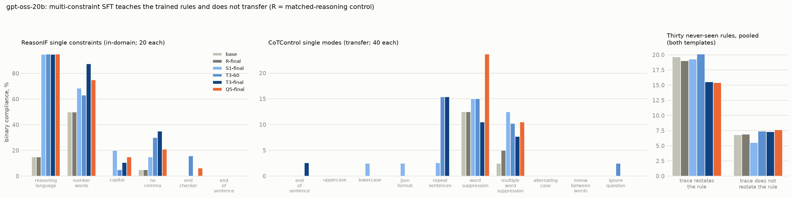

# Multi-constraint SFT on gpt-oss-20b: findings

*Design: `GPTOSS_PLAN.md` (Unsloth 4-bit base, attention-only LoRA r 32, one epoch, 4,096-token cap, medium
reasoning effort, no answer tags). Arms: S1, T3, Q5 (1, 3, 5 constraints per example) and R, the matched-reasoning
control (the same unedited traces under the plain prompt). Evaluated: base, R, S1, T3 step-60 and step-final, Q5.
Binary = constraint satisfied, over rollouts with a closed analysis channel; Fisher tests one-sided. One seed per
arm. Figure: `scripts/report_gptoss.py`.*

## Headline

**On gpt-oss-20b, multi-constraint SFT teaches the trained rules and transfers to essentially nothing else.** The
three constraint arms triple in-domain compliance on single constraints (12 → 33–38 %) while the control arm stays
at base (12 %). On CoTControl the best arm reaches 4.3 % against 1.8 % for the control, carried by one mode. On the
thirty never-seen rules the trained arms appear to *lose* compliance (15 % → 8–9 %), but that is an artefact: base
gpt-oss restates the rule inside its reasoning, the restatement satisfies several rules by itself, and training
removed the restating. Among traces that do not restate the rule, every arm passes 5–8 %, base and control included.

## Numbers

| joint binary | base | R | S1 | T3-60 | T3-final | Q5 |
|---|---:|---:|---:|---:|---:|---:|
| ReasonIF, 1 constraint | 11.8 | 11.7 | 33.3 | 35.0 | 37.6 | 35.1 |
| ReasonIF, 3 constraints | 0.0 | 0.0 | 5.9 | 13.6 | 11.4 | 5.2 |
| ReasonIF, 5 constraints | 0.0 | 0.0 | 2.5 | 2.5 | 5.1 | 7.5 |
| CoTControl single modes | 1.5 | 1.8 | 3.5 | 4.3 | 3.6 | 3.4 |
| never-seen rules, all 30 | 15.4 | 15.0 | 7.9 | 9.2 | 8.9 | 8.8 |
| never-seen, traces that do not restate the rule | 6.8 | 6.9 | 5.5 | 7.4 | 7.3 | 7.6 |

n = 109–120 per checkpoint for ReasonIF k = 1, 149–157 for k = 3, 39–40 for k = 5, 381–400 for CoTControl,
about 1,170–1,195 for the never-seen rules.

## Findings

**1. In-domain learning works, but the multi-constraint advantage is small.** All three constraint arms learn
reasoning_language almost perfectly (15 → 95 %) and move number_words and no_comma. Capital, end_checker and
end_of_sentence barely move (0–20 %). On single constraints T3 and S1 are within noise (37.6 vs 33.3 %, p = 0.30).
On three-constraint prompts T3-60 beats S1 (13.6 vs 5.9 %, p = 0.017), the one place the Qwen pattern
replicates. Q5 is not better than T3 anywhere except its own five-constraint prompts (7.5 vs 5.1 %, n = 40). The
control arm R is identical to base on every in-domain number, so the gains are the constraints, not SFT on the
model's own traces.

**2. Transfer to CoTControl is marginal and not in the Qwen modes.** Pooled over the ten modes, T3-60 is 4.3 %
against R's 1.8 % (p = 0.03); Q5 3.4 % (p = 0.11). The one mode that moves clearly is repeat_sentences for T3
(6/39 at both checkpoints vs 0/40 for R, p = 0.012): the model writes the required sentence at start and end. The
four Qwen3-8B movers do not move at all: uppercase, lowercase, end_of_sentence and JSON are at 0–1 of 40 for every
arm, even though uppercase and end_of_sentence restate trained rules. Word suppression is high for everyone
(base 5/40, Q5 9/38, n.s.) because gpt-oss's short traces rarely use the keyword anyway.

**3. The never-seen "drop" is narration, not unlearning.** Base gpt-oss opens two thirds of its traces on
never-seen prompts by restating the rule ("The user said: 'include quotes within quotes within quotes…'"). That
restatement contains nested quotes, several conjunctions and a spread of punctuation, so it satisfies
quotes_nested (base 37/39), palindromes, conjunctions, punctuation_all and parentheses_nested without the model
doing anything else. The constraint arms were trained on traces that never restate a rule, so they restate in
15–19 % of traces, against 67 % for base and R, and lose those accidental passes. Split by whether the trace
restates the rule, pass rates are flat across all six checkpoints: 15–20 % when restating, 5.5–7.6 % when not.
Only one never-seen rule separates from the control: repeats (no word more than ten times), Q5 16/40 vs R 4/40
(p = 0.002), which Q5's shorter traces satisfy.

**4. Meta-discussion is a confound in the other direction too.** On Qwen, narration was a reason traces *failed*
all-or-nothing rules; here it is a reason base traces *pass* inclusion rules. Any never-seen rule that can be
satisfied by quoting it (nested quotes, punctuation sets, conjunction counts, palindromes, parentheses) measures
narration as much as control. Those five should be flagged or dropped from the never-seen set for every model,
and the Qwen3-8B batch-2 numbers on them re-read in that light (base Qwen3-8B also scored on quotes_nested and
palindromes).

**5. Costs.** CoTControl accuracy is unchanged (50–56 % vs base 56 %). ReasonIF accuracy (22–34 %) is not
interpretable: without answer tags the fallback extractor misses many untagged answers, for base as much as for
the arms. Trace length on CoTControl is similar across arms (median 950–1,750 tokens against base 1,090), so the
transfer differences are not a length artefact here.

## Across the three models

| | Qwen3.5-9B | Qwen3-8B | gpt-oss-20b |
|---|---|---|---|
| in-domain, triples vs singles (single-constraint prompts) | 52 vs 26 % | 52 vs 42 % | 38 vs 33 % (n.s.) |
| best CoTControl transfer, binary | 2.5 % (T3) | 12.1 % (Q5), mostly restating modes and JSON | 4.3 % (T3-60), mostly repeat_sentences |
| novel rules that move | none clearly | JSON, stop_words | repeat_sentences, repeats |
| matched-reasoning control | not run | not run | = base everywhere |

The one pattern that holds on all three: single-constraint training transfers nothing, and whatever multi-constraint
training transfers is one or two rules, different on each model, not a general ability.

## Caveats

- One seed; attention-only LoRA (Qwen runs adapted every linear layer), so gpt-oss's arms may have learned less
  per example; the 4,096-token cap dropped 5–13 examples per arm.
- gpt-oss was trained and evaluated at medium reasoning effort only.
- The "restates the rule" split is a word-overlap heuristic (at least 60 % of the rule's content words, or "the
  user said", "rules:", "requirement"), not the full-trace narration lister.
- ReasonIF accuracy is unreliable without answer tags; CoTControl accuracy is the trustworthy one.
