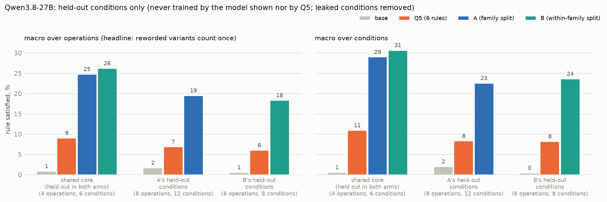
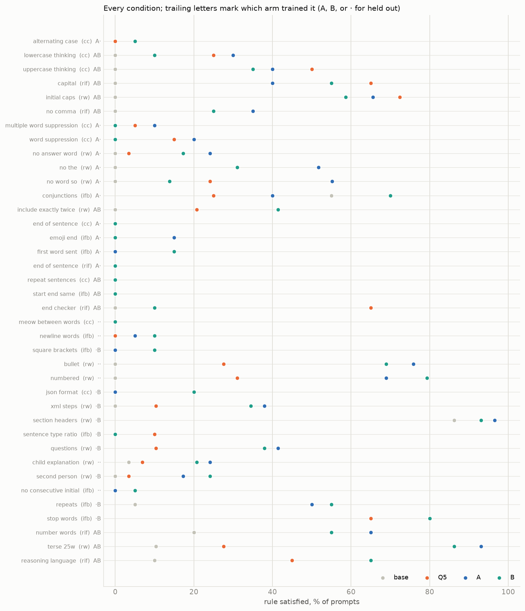
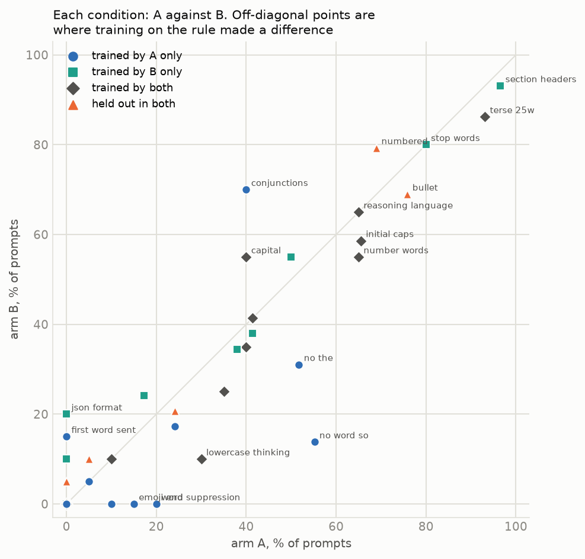
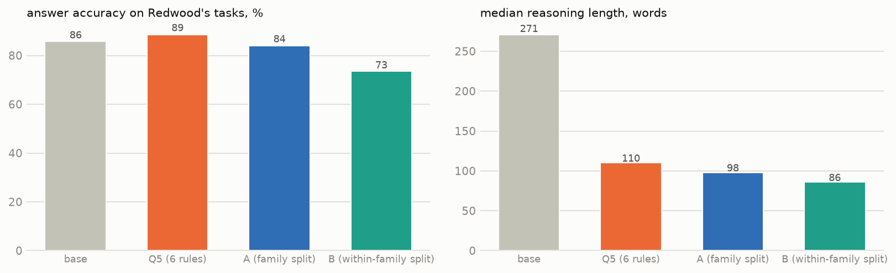
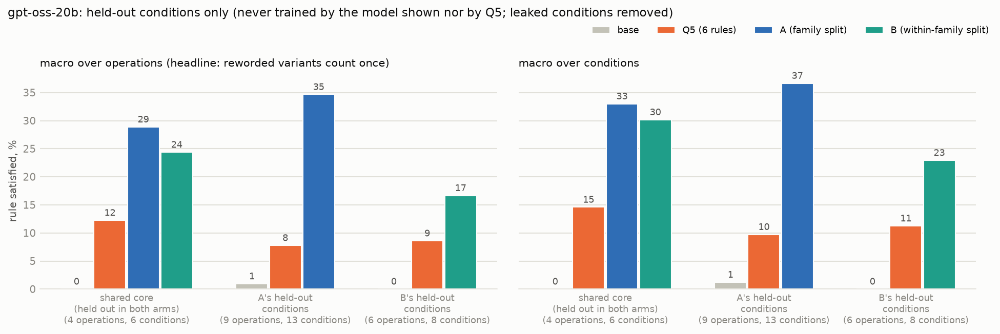
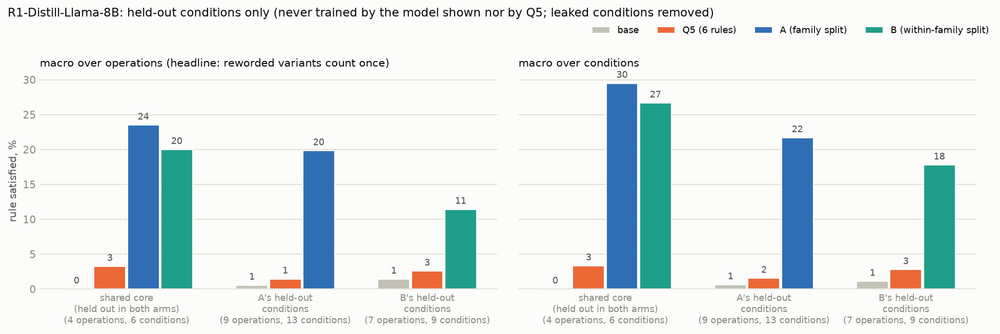
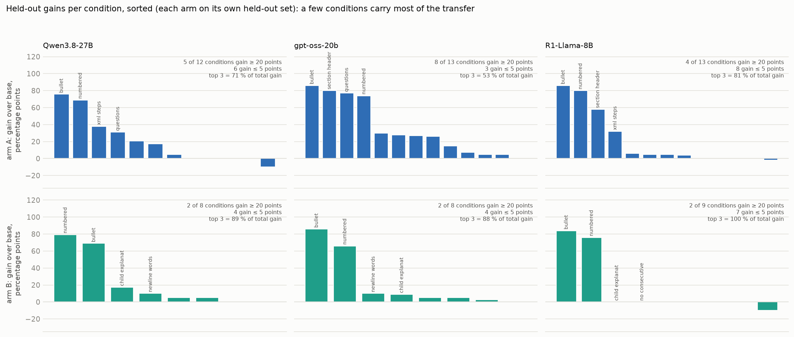
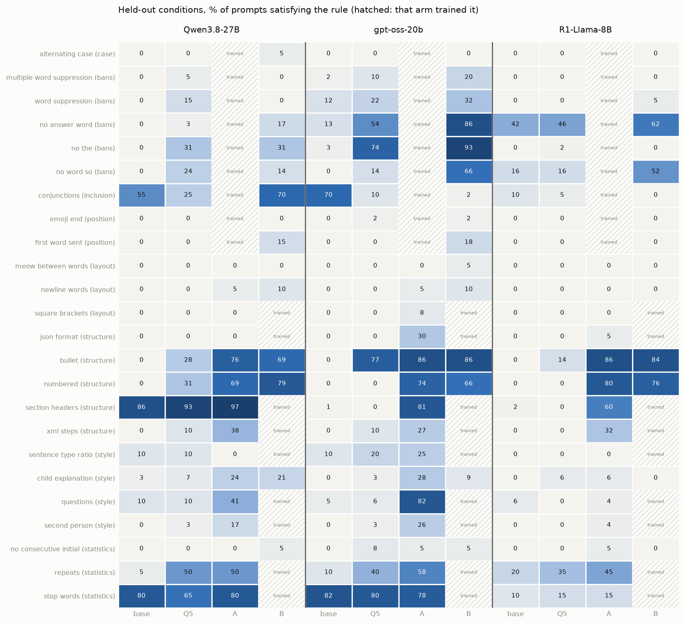

# Many-rule SFT: findings (Qwen3.8-27B, gpt-oss-20b, R1-Distill-Llama-8B)

*2026-10-01, corrected 2026-10-03 (see the correction section below). Plan and design: `MANY_RULES_PLAN.md`. Base Qwen3.8-27B, Q5 (6 rules, 5 per example), and two new arms
trained on about 32 rules with 7 per example:*
- *A: whole families held out;*
- *B: every splittable family on both sides, split by operation.*

*Setup: QLoRA, one epoch on about 440 examples, Red Hat's INT4 weights for evaluation, single-rule prompts identical
across the four models. 20 prompts per condition (29 for Redwood's). Figures come from `scripts/report_many_rules.py`.*

## Correction (2026-10-03): how the headline is measured

A review of the split (`CONDITION_SPLIT.md`, "Overlaps and leakage") found two problems with the first version of
these numbers. All headline numbers below are corrected for both.

1. **Reworded variants were counted separately.** Many conditions are one rule in different benchmarks' wording.
   Bullets and numbered steps are one operation, and the five word bans are one rule with different words. A macro
   over conditions therefore counted an operation twice (or five times) whenever it had several variants. The
   headline is now a **macro over operations**: average each operation's conditions first, then average the
   operations.
2. **Some held-out conditions leaked into training.** Training satisfies them as a side effect, without the rule
   being trained:
   - **B's word bans and "Indeed" first word.** B's stop-word rewrite deletes "the" and other function words, and
     short word caps remove the rest, so 96 % of B's English training traces lack "so" and 63 % lack "the". B's
     "hence"-insertion also puts a fixed word at sentence starts, which is close to "Indeed".
   - **A's "no word more than 10 times" and stop-word limit.** A's length training satisfies both.

   These conditions are now removed from each arm's own held-out set. They still appear, flagged, in the
   per-condition figures.

The conclusion is unchanged: many-rule training transfers several times more than Q5. The A-against-B comparison
changes, though: **once the leaked conditions are removed, B never beats A on its own held-out set.**

## Headline

On Qwen3.8-27B (macro over operations):
- **Shared core** (4 operations, 6 conditions, held out by both arms and by Q5): base 1 %, Q5 9 %, A 25 %, B 26 %.
- **Each arm's own clean held-out set:** A reaches 19 % against Q5's 7 %, and B reaches 18 % against Q5's 6 %.

Each bar counts only conditions that the model shown never trained on, and that Q5 never trained on either. The
conditions base already passes (40 % or more) are left out, and so are the leaked conditions.

**The within-family split (B) does not transfer more than the family split (A).** The two are level here. B's clean
held-out set is small: it is mostly the shared core plus alternating case and emoji at the end of each sentence.

## What transfers and what does not

1. **Structure and style transfer strongly**, with none of these rules trained by A:

   | condition | Q5 | A |
   |---|---:|---:|
   | bullets | 28 % | 76 % |
   | numbered | 31 % | 69 % |
   | XML steps | 10 % | 38 % |
   | questions | 10 % | 41 % |
   | child explanation | 7 % | 24 % |
   | second person | 3 % | 17 % |

2. **Word-level layout and letter-level rules do not transfer.** Meow between words, one word per line, square
   brackets and no-consecutive-initials stay at 0–10 % for every model.
3. **Within-family siblings transfer weakly.** Holding out word bans in B leaves them at 0–31 %, at or below Q5,
   even though B's training traces rarely contain the banned words (see the correction). Alternating case stays at 5 %, even
   though B trained uniform case.

## Does training on a rule matter?

Each point is one condition, A's score against B's. Off the diagonal, the arm that trained the rule usually does
better, but the gap is often small:

| condition | A | B | who trained it |
|---|---:|---:|---|
| no "so" | 55 % | 14 % | A |
| no "the" | 52 % | 31 % | A |
| word suppression | 20 % | 0 % | A |
| JSON | 0 % | 20 % | B |
| questions | 41 % | 38 % | B |
| XML steps | 38 % | 34 % | B |

For questions and XML steps, A matches B without having trained the rule. Most of the gain is a general skill,
following a format instruction in the reasoning, rather than the specific rule.

**Some trained rules are not learned at all:**
- the end-of-sentence word, repeat-sentence and start = end word stay at 0 % in both arms;
- the end phrase falls from 65 % (Q5) to 10 %;
- all capitals falls from 65 % to 40–55 %.

Each rule now appears in about 60–150 examples, against about 380 per rule in Q5, so per-rule learning is shallower.

## Cost

**Accuracy on Redwood's tasks** is 86 % for base, 89 % for Q5, 84 % for A and **74 % for B**, so B loses 12 points.
Reasoning is shorter for every fine-tuned model: a median of 86–110 words, against 271 for base. B's training mix
leans on terse, telegraphic and question-style rewrites. That probably explains why its reasoning is shortest and its
accuracy lowest, but I have not tested that.

## Summary

- More rules widen transfer: about three times Q5 on the shared core (25–26 % against 9 %, per operation), with A
  at no meaningful accuracy cost.
- Splitting within families (B) does not strengthen transfer, and it costs accuracy.
- Transfer goes to line-level structure and style (lists, XML, questions, register), not to word-level or letter-level
  operations, and only weakly to siblings of the trained rules.
- Many specific trained rules stay unlearned. The broader training seems to teach "obey a formatting instruction in
  the reasoning" more than any single rule.

## Replication on gpt-oss-20b

*Same registry, splits and 7 conditions per example. The setup otherwise follows the earlier gpt-oss runs:*
- *about 900 examples per arm (A 919, B 878), the same size as gpt-oss's own Q5 (906);*
- *attention-only LoRA, one epoch;*
- *medium reasoning effort, no answer-tag line;*
- *40 prompts per CoTControl mode and per IFBench rule, 20 per ReasonIF rule;*
- *Redwood: 100 tasks per instruction with greedy decoding, as in the earlier gpt-oss Redwood runs.*

The result holds on a second model family.

Macro over operations, with leaked conditions removed:
- **Shared core:** base 0 %, Q5 12 %, A 29 %, B 24 %.
- **Each arm's own clean held-out set:** A reaches 35 % against Q5's 8 %, and B reaches 17 % against Q5's 9 %.
- **Accuracy on Redwood's tasks:** 84 % for base and 80 % for all three fine-tuned models. B does not lose more than
  the others here, unlike on Qwen.

**Word bans in B on gpt-oss: mostly leakage.** B never trained a word ban, yet it reaches 66–93 % on no "so",
no "the" and no "answer", close to A, which trained them. Most of this is leakage rather than transfer. B's training
traces almost never contain "so" or "the" (see the correction above), and gpt-oss's Q5 already reaches 54–74 % on
two of the bans. The first version of this document counted these as within-family transfer. Without them, B's own
held-out score falls from 36 % to 17 %.

**Held-out transfer that is new on gpt-oss** (each condition held out by the arm named):

| condition | base | Q5 | arm | score |
|---|---:|---:|---|---:|
| numbered | 0 % | 0 % | A | 74 % |
| section headers | 1 % | 0 % | A | 81 % |
| XML steps | 0 % | 10 % | A | 27 % |
| questions | 5 % | 6 % | A | 82 % |
| "Indeed" as first word of each sentence (leaked, see the correction) | 0 % | 0 % | B | 18 % |

**The same failures as on Qwen.** The same word-level and letter-level rules stay at 0–10 % for every arm: meow,
one word per line, no consecutive initials, alternating case and emoji at the end of each sentence.

Per-condition figures: `figures/many_gptoss_per_condition.png` and `figures/many_gptoss_a_vs_b.png`.

## Replication on DeepSeek-R1-Distill-Llama-8B

*A third model family (Llama base). The whole chain was run fresh: base, Q5, A and B.*
- *Training: QLoRA on a 4-bit base, all linear layers, one epoch, about 900 examples per arm (Q5 916, A 920,
  B 872).*
- *Evaluation: served in bf16, with DeepSeek's sampling (T 0.6, top-p 0.95).*
- *Prompts: 20 per condition; Redwood 50 tasks per instruction.*

The pattern holds, and the gap is larger than on the other two models, because Q5 barely transfers on this model.

Macro over operations, with leaked conditions removed:
- **Shared core:** base 0 %, Q5 3 %, A 24 %, B 20 %.
- **Each arm's own clean held-out set:** A reaches 20 % against Q5's 1 %, and B reaches 11 % against Q5's 3 %.
- **Accuracy on Redwood's tasks:** 67 % for base and Q5, 64 % for A, 62 % for B.
- **Reasoning length:** shorter after many-rule training, a median of 134–146 words against 399 for base.

**Held-out structure transfer,** for rules A never trained:

| condition | base | Q5 | A |
|---|---:|---:|---:|
| bullets | 0 % | 14 % | 86 % |
| numbered | 0 % | 0 % | 80 % |
| section headers | 2 % | 0 % | 60 % |
| XML steps | 0 % | 0 % | 32 % |

**Like Qwen, unlike gpt-oss,** style rules transfer weakly: questions reach 4 % and second person 4 % in A, against
48 % and 24 % in B, which trained them. Word bans held out in B reach 52–62 % on no "so" and no "answer", but stay
near 0 % on the CoTControl word-suppression modes and on no "the". The same word-level and letter-level rules stay
at 0–5 % on all three models.

## Across the three models

| held-out, macro over operations, leaked conditions removed | Qwen3.8-27B | gpt-oss-20b | R1-Distill-Llama-8B |
|---|---:|---:|---:|
| shared core: base / Q5 / A / B | 1 / 9 / 25 / 26 | 0 / 12 / 29 / 24 | 0 / 3 / 24 / 20 |
| A's clean held-out: Q5 → A | 7 → 19 | 8 → 35 | 1 → 20 |
| B's clean held-out: Q5 → B | 6 → 18 | 9 → 17 | 3 → 11 |
| accuracy: base / A / B | 86 / 84 / 74 | 84 / 80 / 80 | 67 / 64 / 62 |

On all three models, many-rule training lands at 20–29 % on the shared core, 2–7 times Q5. In every case the gain
comes from line-level structure: bullets, numbered steps, section headers, XML. Splitting within families (B) never
beats splitting by family (A) on its own held-out set. On the shared core the two are level on Qwen and A leads on
the other two models.

## Is transfer spread evenly or concentrated?

Transfer is concentrated, not even. Each panel sorts one arm's own held-out conditions by gain over base.

| model, arm | conditions gaining ≥ 20 points | conditions gaining ≤ 5 points | top-3 share of total gain |
|---|---:|---:|---:|
| Qwen3.8-27B, A | 5 of 12 | 6 | 71 % |
| Qwen3.8-27B, B | 2 of 8 | 4 | 89 % |
| gpt-oss-20b, A | 8 of 13 | 3 | 53 % |
| gpt-oss-20b, B | 2 of 8 | 4 | 88 % |
| R1-Distill-Llama-8B, A | 4 of 13 | 8 | 81 % |
| R1-Distill-Llama-8B, B | 2 of 9 | 7 | 100 % |

*Each arm's own held-out set, leaked conditions removed.*

- **Bullets and numbered steps lead in every panel,** with gains of 65–86 points. For B, those two are almost the
  whole gain on every model.
- **gpt-oss with A is the broadest.** The gain extends to questions, section headers, second person, JSON and the
  sentence ratio.
- **The rest sit near zero on every model:** meow, one word per line, square brackets, alternating case, emoji at the
  end of each sentence, and no consecutive initials. These need the operation applied to every word or letter, which
  none of the trained rules practised.

The heatmap shows every held-out condition for each model and arm. Hatched cells are conditions that arm trained.

## Caveats

- **Noise.** One seed and 20–29 prompts per condition, so single-condition differences under about 25 points are
  noise. The pooled numbers cover 6–14 conditions.
- **gpt-oss restates the rule.** It often repeats the instruction in its reasoning. That cannot help it pass a ban, but
  it can inflate inclusion rules.
- **Judge.** Second person and questions are judged by gpt-4.1, the same judge that verified the training data. B
  trained against that judge, so B's numbers on those two could partly reflect fitting the judge. A never saw those
  rules.
- **Short reasoning helps some rules.** It satisfies terse, "no word more than 10 times" and the word bans more
  easily. Every fine-tuned model writes shorter reasoning than base.
- **A and B differ in more than the split.** Their mixes differ in size (456 against 427 examples) and in coverage per
  rule, as well as in which rules they train.
- **Redwood macro.** Several Redwood instructions are now trained, so no Redwood macro over all nine instructions is
  quoted.
