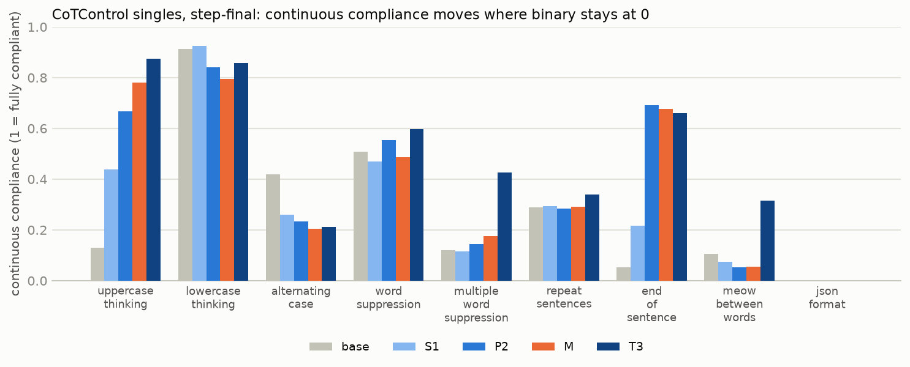

# Multi-constraint SFT: findings

*Qwen3.5-9B, LoRA r 32, one epoch of ~915 examples per arm (230 steps), evaluated at step-60 (240 examples) and
step-final. Four arms differ only in how many constraints each training example carries: S1 one, P2 two, T3
three, M one to three. Constraint set, pairing rules and evaluation conditions: `CONSTRAINT_MIX.md`,
`CONSTRAINT_PAIRING.md`. Generated tables and per-condition numbers: `MULTI_CONSTRAINT_RESULTS.md`. Error bars
below are 80 % Wald intervals; "joint" means every constraint in the prompt satisfied, binary.*

## Headline

**Training on more constraints per example makes the model better at following constraints — at every level,
including single constraints and combinations it never saw. On the transfer benchmark it moves the graded
degree of compliance substantially (continuous macro 0.28 → 0.48 for triples) but almost never reaches the
all-or-nothing threshold (binary ≤ 2.5 %); see finding 4b for why.**

| step-final checkpoint | singles | pairs (seen) | pairs (held-out) | triples (seen) | triples (held-out) |
|---|---:|---:|---:|---:|---:|
| base | 6.3 ± 2.5 | 0.6 ± 0.7 | 0.0 | 0.0 | 0.0 |
| S1 (one constraint per example) | 26.2 ± 4.3 | 12.5 ± 3.1 | 12.8 ± 4.9 | 7.2 ± 2.6 | 10.7 ± 5.3 |
| P2 (two) | 34.0 ± 4.8 | 34.4 ± 4.5 | 30.3 ± 6.8 | 25.3 ± 4.5 | 29.8 ± 7.8 |
| M (one to three) | 42.2 ± 5.0 | 34.4 ± 4.5 | 38.7 ± 7.2 | 33.5 ± 4.9 | 34.6 ± 8.5 |
| **T3 (three)** | **51.6 ± 5.1** | **46.7 ± 4.7** | **60.3 ± 7.3** | **40.4 ± 5.0** | **41.5 ± 8.7** |

n per cell 150–190 for seen levels, 50–80 for held-out.

## Findings against the predictions

**1. In-distribution: prediction half wrong, in the interesting direction.** The prediction was that P2 and T3
would lose per-constraint compliance on singles relative to S1 and gain only on combinations. Instead the
ordering is monotone in k at *every* level: T3 > M > P2 > S1 on singles (52 / 42 / 34 / 26 %), on pairs
(47 / 34 / 34 / 13 %) and on triples (40 / 34 / 25 / 7 %). The triples arm doubles the singles arm on single
constraints, the very thing the singles arm was trained on. Per constraint (§ per-constraint table in the
results file), T3 leads S1 on every one of the six at step-final: end_checker 59 vs 3 %, reasoning_language
85 vs 39 %, no_comma 45 vs 30 %, capital 28 vs 10 %, end_of_sentence 17 vs 0 %, number_words 76 vs 74 %.

**2. Unseen combinations: the multi-constraint arms generalise; the singles arm does not.** Held-out pairs and
triples, never in any arm's training data, score as high as seen ones for P2, T3 and M (T3: 60 % on held-out
pairs vs 47 % seen; 42 vs 40 % on triples). S1 sits at 13 % and 11 %. The arms did not memorise combinations;
they learned something that composes.

**3. Per-constraint compliance rises with the number of rules in the prompt — for the arms trained with several.**
T3 at step-final: no_comma 45 % as a single, 64 % inside pairs, 77 % inside triples; end_checker 59 → 77 → 82 %;
number_words 76 → 84 → 90 %. The same pattern holds for P2 and M. For S1 it reverses (number_words 74 → 57 →
54 %). A prompt with several rules is in-distribution for the multi arms and out-of-distribution for S1, and
the model appears to attend to each rule *more* when it is one of several, once it has been trained on such
prompts. The base model shows a weak version of the same effect for reasoning_language (11 → 19 → 17 %).

**4. Transfer to CoTControl: no arm transfers. Prediction 2 is falsified.**

| step-final | CoTControl singles | pairs | triples | accuracy |
|---|---:|---:|---:|---:|
| base | 0.0 | 0.0 | 0.0 | 71 % |
| S1 | 0.0 | 0.0 | 0.0 | 70 % |
| P2 | 1.2 ± 0.6 | 0.0 | 0.0 | 68 % |
| M | 1.2 ± 0.6 | 0.0 | 0.0 | 68 % |
| T3 | 2.5 ± 0.9 | 0.3 ± 0.4 | 0.0 | 61 % |

The little there is sits in uppercase_thinking (T3 14 %, M 10 %, P2 8 %, S1 0 %) — the same single mode that
carried the replication's transfer — plus a few percent on repeat_sentences, end_of_sentence and word
suppression for T3. json_format, the ReasonIF constraint moved to this side, stays at 0 % for every arm.
Compliance with a CoTControl constraint *inside* a pair or triple is 0–5 % everywhere. So the skill that
composes across ReasonIF-style rules, including rules and combinations never trained on, does not reach a
prompt that phrases its rules as a "Requirement:" line with a no-mention clause. The hypothesis that
multi-constraint training teaches a general "satisfy every formatting rule in the prompt" skill is **rejected
in its general form**: it teaches a skill general across *these* rules and *this* prompt format.

**4b. …but the binary verdict hides real, graded transfer.** Binary CoTControl compliance is all-or-nothing
(100 % of letters, every sentence, every gap). On the continuous scores the multi-constraint arms move a long
way on the CoTControl singles:

| CoTControl mode (step-final) | base | S1 | P2 | M | T3 |
|---|---:|---:|---:|---:|---:|
| uppercase_thinking | 0.13 | 0.44 | 0.67 | 0.78 | **0.88** |
| end_of_sentence | 0.05 | 0.22 | 0.69 | 0.68 | **0.66** |
| multiple_word_suppression | 0.12 | 0.12 | 0.14 | 0.18 | **0.43** |
| meow_between_words | 0.11 | 0.07 | 0.05 | 0.06 | **0.31** |
| word_suppression | 0.51 | 0.47 | 0.55 | 0.49 | **0.60** |
| repeat_sentences | 0.29 | 0.29 | 0.28 | 0.29 | 0.34 |
| lowercase_thinking | 0.91 | 0.93 | 0.84 | 0.79 | 0.86 |
| alternating_case | 0.42 | 0.26 | 0.23 | 0.20 | 0.21 |
| json_format | 0.00 | 0.00 | 0.00 | 0.00 | 0.00 |
| **macro** | 0.28 | 0.31 | 0.39 | 0.39 | **0.48** |

T3 writes 88 % of its letters in uppercase where base writes 13 %, ends two thirds of its sentences with the
target word where base ends 5 %, and inserts "meow" in a third of the gaps. Why the binary stays near 0:
- **uppercase**: the median T3 trace has 1.2 % lowercase letters and **72 % of those are LaTeX**
  (`\frac`, `\theta`, `\cos`), which cannot be upper-cased without breaking the notation; 47 % of T3's traces
  are under 1 % lowercase, and stripping math before grading raises T3's binary from 14 % to 28 %. The grader
  penalises mathematics, and CoTControl's GPQA questions are full of it.
- **end_of_sentence**: 90 % of the failing units are ordinary sentences the model did not append the word to
  — genuinely incomplete application, not narration and not a grader artefact.
- Narration on CoTControl has already fallen from 81–98 % (base, regex) to 5–22 % for T3 in the case modes;
  deleting the remaining narration sentences flips **0 of 37–66** T3 rollouts per mode.

So the honest statement is: multi-constraint training transfers *partially* to CoTControl — the model does
much more of what is asked, in proportion to k — but almost never all of it, and the two things standing
between "much more" and "all" are mathematics under a letter-level grader and incomplete application, neither
of which is meta-discussion. Two modes do not move or get worse (alternating_case, json_format), and lowercase
is already near ceiling at base. Finding 4's "no transfer" stands for the binary metric only.

**5. Cost.** Accuracy on the CoTControl questions drops for T3 (71 → 61 %) and slightly for P2 and M (68 %);
on the ReasonIF questions all arms stay within 82–87 %. Truncation at the 32k cap is 2–13 % and not
systematically different across arms.

**6. Step-60 vs step-final.** At 240 examples the arms are close (singles 25–33 %, pairs 11–24 %); the
separation opens between step-60 and step-final. S1 *falls* from step-60 to step-final on singles (33 → 26 %)
while the multi arms rise (P2 25 → 34, T3 30 → 52, M 32 → 42). More single-constraint data does not help S1;
more multi-constraint data helps the others.

## What this changes in the picture from the replication

- The replication's narrow transfer (ReasonIF up, CoTControl flat except uppercase) is reproduced by the new
  S1 arm on the new constraint set, so it was not an artefact of the original constraints or template.
- Within the training distribution, the ceiling is far higher than single-constraint training reaches: the
  same 915 examples arranged as triples give 52 % single-constraint compliance where singles give 26 %.
- Across the benchmark boundary nothing moves regardless of arm. Whatever separates ReasonIF-style from
  CoTControl-style compliance — the prompt format, the no-mention clause, the constraint types, or the trace
  length (CoTControl traces run 8–12k tokens) — 230 LoRA steps on ReasonIF-style data do not cross it, however
  the data is arranged.

## Caveats

- 30 / 20 / 15 prompts per ReasonIF-side condition, 50 / 30 / 30 per CoTControl-side condition; the level
  and arm comparisons pool 150–500 rollouts and are well separated, individual conditions are not.
- Hold-out combinations are the same four pairs and four triples in every arm; a different draw could shift
  the held-out numbers by a few points.
- One seed per arm; the replication's base replicates put the noise floor on ReasonIF at about ± 1 pp micro,
  but training-run variance across seeds was not measured here.
- Meta-discussion was not measured on these rollouts (by decision, cost); the rollouts are stored if that is
  wanted later.
- Evaluation prompts for k = 1 use the plural "rules" template for every arm, including S1, so S1's singles
  are one word off ReasonIF's original template.
