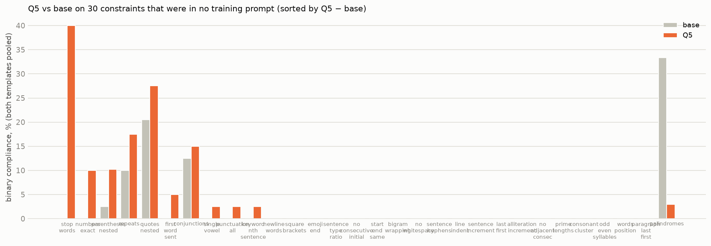

# Never-seen constraints: base vs Q5 (30 IFBench-derived rules, both templates)

*Binary %, continuous mean; 20 prompts per constraint per template. Batch 1 (first ten) also has S1-final and T3-60. Generated by `scripts/report_never_seen.py`.*

| constraint | granularity | base rif | base cc | Q5 rif | Q5 cc | S1 rif/cc | T3-60 rif/cc |
|---|---|---:|---:|---:|---:|---:|---:|
| newline_words | whole-trace | 0 / 0.01 | 0 / 0.00 | 0 / 0.03 | 0 / 0.00 | 0 / 0.01 · 0 / 0.01 | 0 / 0.02 · 0 / 0.00 |
| square_brackets | per-word | 0 / 0.00 | 0 / 0.00 | 0 / 0.00 | 0 / 0.00 | 0 / 0.00 · 0 / 0.00 | 0 / 0.00 · 0 / 0.00 |
| stop_words | whole-trace | 0 / 0.76 | 0 / 0.78 | 50 / 0.91 | 30 / 0.89 | 0 / 0.75 · 0 / 0.79 | 10 / 0.82 · 20 / 0.83 |
| emoji_end | per-sentence | 0 / 0.01 | 0 / 0.00 | 0 / 0.00 | 0 / 0.02 | 0 / 0.00 · 0 / 0.01 | 0 / 0.00 · 0 / 0.00 |
| first_word_sent | per-sentence | 0 / 0.05 | 0 / 0.00 | 5 / 0.12 | 5 / 0.35 | 0 / 0.00 · 0 / 0.01 | 0 / 0.16 · 0 / 0.26 |
| sentence_type_ratio | per-sentence | 0 / 0.00 | 0 / 0.00 | 0 / 0.00 | 0 / 0.00 | 0 / 0.00 · 0 / 0.00 | 0 / 0.00 · 0 / 0.00 |
| no_consecutive_initial | per-token | 0 / 0.93 | 0 / 0.94 | 0 / 0.93 | 0 / 0.94 | 0 / 0.93 · 0 / 0.94 | 0 / 0.93 · 0 / 0.94 |
| conjunctions | counting | 25 / 0.82 | 0 / 0.78 | 25 / 0.77 | 5 / 0.73 | 10 / 0.79 · 5 / 0.77 | 11 / 0.78 · 0 / 0.76 |
| start_end_same | boundary | 0 / 0.00 | 0 / 0.00 | 0 / 0.00 | 0 / 0.00 | 0 / 0.00 · 0 / 0.00 | 0 / 0.00 · 0 / 0.00 |
| repeats | whole-trace lexical | 20 / 0.93 | 0 / 0.88 | 30 / 0.94 | 5 / 0.90 | 25 / 0.93 · 0 / 0.86 | 20 / 0.93 · 5 / 0.88 |
| bigram_wrapping | per-word format | 0 / 0.00 | 0 / 0.00 | 0 / 0.00 | 0 / 0.02 | — · — | — · — |
| no_whitespace | whole-trace | 0 / 0.80 | 0 / 0.82 | 0 / 0.80 | 0 / 0.83 | — · — | — · — |
| sentence_hyphens | whole-trace | 0 / 0.00 | 0 / 0.00 | 0 / 0.00 | 0 / 0.00 | — · — | — · — |
| line_indent | whole-trace | 0 / 0.00 | 0 / 0.00 | 0 / 0.02 | 0 / 0.00 | — · — | — · — |
| sentence_increment | per-sentence | 0 / 0.09 | 0 / 0.06 | 0 / 0.06 | 0 / 0.04 | — · — | — · — |
| last_first | per-sentence | 0 / 0.01 | 0 / 0.01 | 0 / 0.01 | 0 / 0.00 | — · — | — · — |
| alliteration_increment | per-sentence | 0 / 0.24 | 0 / 0.25 | 0 / 0.25 | 0 / 0.31 | — · — | — · — |
| no_adjacent_consec | per-token | 0 / 0.90 | 0 / 0.91 | 0 / 0.90 | 0 / 0.91 | — · — | — · — |
| prime_lengths | per-token | 0 / 0.62 | 0 / 0.59 | 0 / 0.61 | 0 / 0.55 | — · — | — · — |
| single_vowel | per-token | 0 / 0.63 | 0 / 0.61 | 5 / 0.63 | 0 / 0.58 | — · — | — · — |
| consonant_cluster | per-token | 0 / 0.54 | 0 / 0.56 | 0 / 0.55 | 0 / 0.63 | — · — | — · — |
| odd_even_syllables | per-token | 0 / 0.36 | 0 / 0.37 | 0 / 0.34 | 0 / 0.40 | — · — | — · — |
| palindromes | inclusion | 47 / 0.51 | 20 / 0.23 | 0 / 0.01 | 7 / 0.25 | — · — | — · — |
| numbers_exact | counting | 0 / 0.09 | 0 / 0.06 | 5 / 0.15 | 15 / 0.30 | — · — | — · — |
| punctuation_all | inclusion | 0 / 0.64 | 0 / 0.64 | 0 / 0.61 | 5 / 0.64 | — · — | — · — |
| parentheses_nested | structure | 0 / 0.32 | 5 / 0.51 | 5 / 0.35 | 16 / 0.57 | — · — | — · — |
| quotes_nested | structure | 16 / 0.65 | 25 / 0.60 | 20 / 0.60 | 35 / 0.63 | — · — | — · — |
| words_position | positional | 0 / 0.00 | 0 / 0.00 | 0 / 0.00 | 0 / 0.03 | — · — | — · — |
| keyword_nth_sentence | positional | 0 / 0.00 | 0 / 0.00 | 0 / 0.00 | 5 / 0.05 | — · — | — · — |
| paragraph_last_first | per-paragraph | 0 / 0.00 | 0 / 0.00 | 0 / 0.00 | 0 / 0.00 | — · — | — · — |

Pooled over all 30 constraints and both templates: base 2.6 % binary, 0.326 continuous (n=1188); Q5 4.5 % binary, 0.337 continuous (n=1191).

