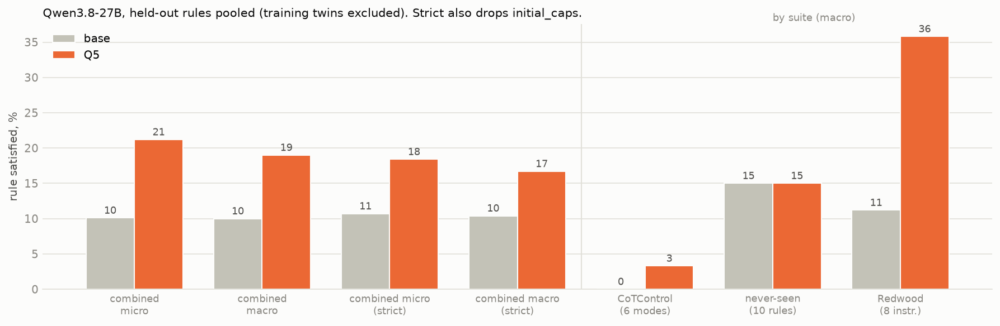

# Multi-constraint SFT on Qwen3.8-27B (4-bit): findings

*2026-10-01. Base Qwen3.8-27B against Q5 (five constraints per training example, 436 examples, one
epoch, QLoRA on a 4-bit base), identical prompts, single-rule prompts only. Evaluation on Red Hat's 4-bit weights with
the adapter applied by vLLM (checked: it changes greedy outputs). Both models are complete on all four suites. 20 prompts per rule; 12,288-token reasoning cap. Figures:
`scripts/report_qwen38.py`.*

## Headline

Fine-tuning works in-domain (our six training constraints, 5 → 46 % of prompts), gives a small transfer to CoTControl
(0 → 11 %), and nothing on the never-seen rules (15 → 15 %). On Redwood's nine held-out instructions (last section)
it transfers clearly: 11 → 35 % macro, at no cost in accuracy. The right panel repeats the comparison on finished traces
only; it changes no conclusion.

## Rule by rule

1. **In-domain, Q5 learns five of the six rules.** Capitals, end phrase and word budget reach 65 % from 0–20 %,
   language 45 %, no comma 35 %. The end-of-sentence word stays at 0 % even after training, although its graded score
   rises a little.
2. **The CoTControl transfer is the trained twins again.** Uppercase reaches 10 of 20 prompts (the twin of the trained
   capital rule; graded score 0.08 → 0.99), lowercase 5 of 20 (its mirror). Beyond those: word suppression 3 of 20,
   multiple-word suppression 1 of 20, graded scores up modestly. JSON, alternating case, meow, repeat sentences, the
   end-of-sentence word and ignore-question stay at 0. Unlike Qwen3-8B, JSON does not move.
3. **No transfer to never-seen rules.** One rule rises, "no word more than ten times" (1 → 10 of 20), which shorter
   traces satisfy. Two fall, conjunctions (11 → 5) and stop words (16 → 13); these are rules base passes by accident
   when it restates the instruction or writes long prose, the same pattern seen on gpt-oss. Everything else is at 0
   for both.

## Trace length and truncation

Base Qwen3.8 cuts off at the 12k cap on 23–35 % of prompts, mostly hard maths and science questions. Q5 cuts off less
(14–24 %), because its traces are shorter. Cut-off traces count as failures for both models, so part of Q5's
advantage comes from finishing more often; but the finished-traces-only panel above shows the in-domain and CoTControl
gains survive without it (in-domain 7 → 53 %, CoTControl 0 → 14 %).

## Redwood's nine held-out instructions

About 29 tasks per instruction, their prompts and scorers, Qwen's recommended thinking sampling.

1. **Q5 transfers to seven of the eight instructions base fails.** Macro raw compliance rises from 11 % to 35 %.
   Initial capitals 0 → 72 %, numbered steps 0 → 31 %, bullets 0 → 28 %, terse (25 words) 10 → 28 %, no "so"
   0 → 24 %, a word exactly twice 0 → 21 %, XML steps 0 → 10 %. Child-style explanation barely moves (3 → 7 %).
2. **Base already writes section headers** (86 %; Q5 93 %). Asked to, base Qwen3.8 structures its reasoning under
   "Given: / Work: / Check:". No other model we tested did this.
3. **Accuracy does not fall.** It is 85 % for base and 88 % for Q5. Q5's traces are shorter (median 107 words against
   290) and cut off slightly less often (18 against 22 of 261).
4. **The passes are genuine.** I read Q5's passing traces. None is an all-caps trace that satisfies initial capitals
   by accident, and bullet passes are real "- " lists. Most do not restate the rule; the exception is "a word exactly
   twice", where all 6 passes name the word.

## All held-out rules pooled

This pools CoTControl, the never-seen rules and Redwood's suite into one number, leaving out the rules that are twins
of a training constraint:
- CoTControl uppercase, which is the trained capital rule;
- CoTControl lowercase, its mirror;
- the CoTControl end-of-sentence word, which is trained;
- Redwood terse_25w, which is the trained word budget;
- ignore-question, which was not judged.

That leaves 24 rules and 552 prompts.

- **Micro** (every prompt weighted equally): 10 → 21 %. The 95 % bootstrap interval on the difference is +8 to +14
  points.
- **Macro** (every rule weighted equally): 10 → 19 %, interval +1 to +18 points. It is wider because only 24 rules are
  resampled.
- **Strict**, also dropping initial capitals because it is close to the capital rule: micro 11 → 18 %, macro
  10 → 17 %. Both intervals stay above zero.

The gain comes almost entirely from Redwood (11 → 36 %). CoTControl adds little (0 → 3 %) and the never-seen rules
add nothing (15 → 15 %), so the pooled number depends heavily on which suite is included.

## Summary

The pattern matches gpt-oss. On the suites we designed, multi-constraint SFT teaches the trained rules and reaches
their direct twins on CoTControl (uppercase, lowercase), but nothing on our never-seen rules. On Redwood's held-out
instructions it transfers broadly: 11 → 35 % macro here, against 14 → 19–28 % for our gpt-oss checkpoints and 14 %
for Redwood's own. So both larger models show transfer, but only to formatting-style instructions (lists,
capitalisation, word bans, brevity) of the kind Redwood tests. Our never-seen rules are mostly counting and lexical
rules, and those do not move. One difference from Qwen3-8B: JSON does not transfer here.

## Caveats

- One seed; 20 prompts per rule, so single-rule differences under about 25 points are noise.
- 4-bit weights for both training and evaluation (different 4-bit builds of the same model); 436 training examples,
  half the size of the Qwen3-8B arms.
- Redwood numbers are raw compliance only (their effective-control judges were not run); about 29 tasks per
  instruction, so differences under about 20 points are noise. Child-style explanation is judged by gpt-4.1-mini.
- CoTControl's ignore-question mode needs the LLM judge and is shown as 0 for both models here.

## Appendix: every condition

Share of prompts satisfying the rule, all prompts, with cut-off traces counted as failures. "Excluded" means left out of the pooled numbers above.

| source | condition | role | n | base | Q5 | Δ |
|---|---|---|---:|---:|---:|---:|
| Training (ReasonIF) | all capitals | trained | 20 | 0 % | 65 % | +65 |
| Training (ReasonIF) | end phrase | trained | 20 | 0 % | 65 % | +65 |
| Training (ReasonIF) | end-of-sentence word | trained | 20 | 0 % | 0 % | +0 |
| Training (ReasonIF) | no commas | trained | 20 | 0 % | 35 % | +35 |
| Training (ReasonIF) | word budget | trained | 20 | 20 % | 65 % | +45 |
| Training (ReasonIF) | reasoning language | trained | 20 | 10 % | 45 % | +35 |
| CoTControl | alternating case | held-out | 20 | 0 % | 0 % | +0 |
| CoTControl | end-of-sentence word | twin (excluded) | 20 | 0 % | 0 % | +0 |
| CoTControl | ignore question | not judged (excluded) | 20 | 0 % | 0 % | +0 |
| CoTControl | JSON format | held-out | 20 | 0 % | 0 % | +0 |
| CoTControl | lowercase | twin (excluded) | 20 | 0 % | 25 % | +25 |
| CoTControl | meow between words | held-out | 20 | 0 % | 0 % | +0 |
| CoTControl | multiple-word suppression | held-out | 20 | 0 % | 5 % | +5 |
| CoTControl | repeat sentences | held-out | 20 | 0 % | 0 % | +0 |
| CoTControl | uppercase | twin (excluded) | 20 | 0 % | 50 % | +50 |
| CoTControl | word suppression | held-out | 20 | 0 % | 15 % | +15 |
| Never-seen (IFBench) | conjunctions | held-out | 20 | 55 % | 25 % | -30 |
| Never-seen (IFBench) | emoji at end | held-out | 20 | 0 % | 0 % | +0 |
| Never-seen (IFBench) | first word of sentence | held-out | 20 | 0 % | 0 % | +0 |
| Never-seen (IFBench) | newline between words | held-out | 20 | 0 % | 0 % | +0 |
| Never-seen (IFBench) | no consecutive initials | held-out | 20 | 0 % | 0 % | +0 |
| Never-seen (IFBench) | no word > 10 times | held-out | 20 | 5 % | 50 % | +45 |
| Never-seen (IFBench) | sentence-type ratio | held-out | 20 | 10 % | 10 % | +0 |
| Never-seen (IFBench) | square brackets | held-out | 20 | 0 % | 0 % | +0 |
| Never-seen (IFBench) | start = end word | held-out | 20 | 0 % | 0 % | +0 |
| Never-seen (IFBench) | stop words | held-out | 20 | 80 % | 65 % | -15 |
| Redwood | no word "so" | held-out | 29 | 0 % | 24 % | +24 |
| Redwood | initial capitals | held-out (dropped in strict) | 29 | 0 % | 72 % | +72 |
| Redwood | word exactly twice | held-out | 29 | 0 % | 21 % | +21 |
| Redwood | bullets | held-out | 29 | 0 % | 28 % | +28 |
| Redwood | numbered steps | held-out | 29 | 0 % | 31 % | +31 |
| Redwood | section headers | held-out | 29 | 86 % | 93 % | +7 |
| Redwood | XML steps | held-out | 29 | 0 % | 10 % | +10 |
| Redwood | terse (25 words) | near-twin (excluded) | 29 | 10 % | 28 % | +17 |
| Redwood | child explanation | held-out | 29 | 3 % | 7 % | +3 |
