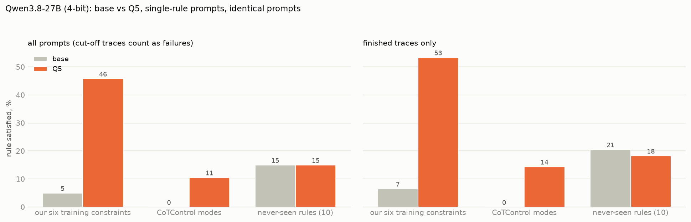
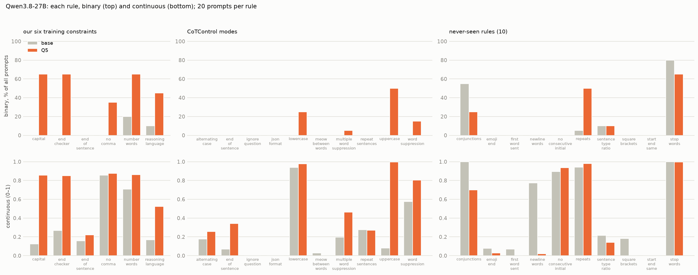
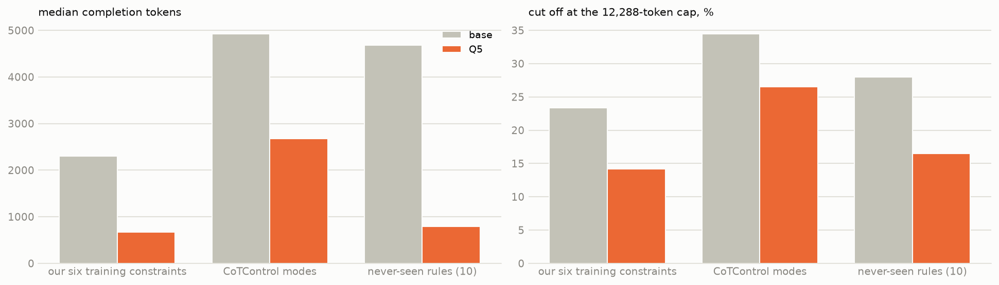
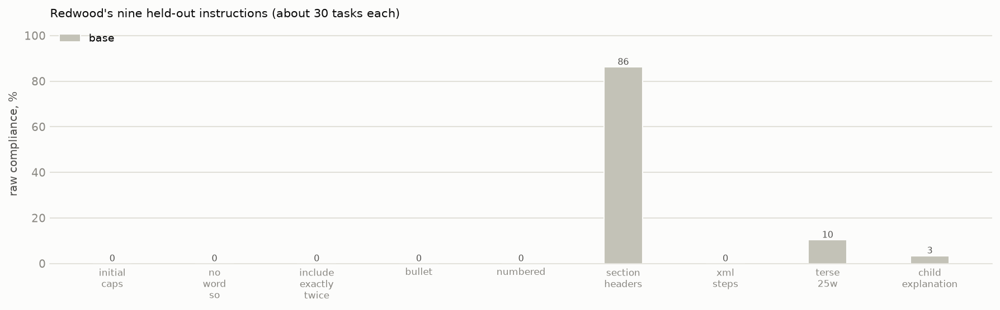

# Multi-constraint SFT on Qwen3.8-27B (4-bit): findings so far

*Interim, 2026-10-01 afternoon. Base Qwen3.8-27B against Q5 (five constraints per training example, 436 examples, one
epoch, QLoRA on a 4-bit base), identical prompts, single-rule prompts only. Evaluation on Red Hat's 4-bit weights with
the adapter applied by vLLM (checked: it changes greedy outputs). Base is complete on all four suites; Q5 is complete
on three and still running Redwood's nine instructions. 20 prompts per rule; 12,288-token reasoning cap. Figures:
`scripts/report_qwen38.py`.*

## Headline

Fine-tuning works in-domain (our six training constraints, 5 → 46 % of prompts), gives a small transfer to CoTControl
(0 → 11 %), and nothing on the never-seen rules (15 → 15 %). The right panel repeats the comparison on finished traces
only; it changes no conclusion.

## Rule by rule

1. **In-domain, Q5 learns five of the six rules.** Capitals, end phrase and word budget reach 65 % from 0–20 %,
   language 45 %, no comma 35 %. The end-of-sentence word stays at 0 % even after training, although its graded score
   rises a little.
2. **The CoTControl transfer is the trained twins again.** Uppercase reaches 10 of 20 prompts (the twin of the trained
   capital rule; graded score 0.08 → 0.99), lowercase 5 of 20 (its mirror). Beyond those: word suppression 3 of 20,
   multiple-word suppression 1 of 20, graded scores up modestly. JSON, alternating case, meow, repeat sentences, the
   end-of-sentence word and ignore-question stay at 0. Unlike Qwen3-8B, JSON does not move.
3. **No transfer to never-seen rules.** One rule rises, "no word more than ten times" (1 → 10 of 20), which shorter
   traces satisfy. Two fall, conjunctions (11 → 5) and stop words (16 → 13); these are rules base passes by accident
   when it restates the instruction or writes long prose, the same pattern seen on gpt-oss. Everything else is at 0
   for both.

## Trace length and truncation

Base Qwen3.8 cuts off at the 12k cap on 23–35 % of prompts, mostly hard maths and science questions. Q5 cuts off less
(14–24 %), because its traces are shorter. Cut-off traces count as failures for both models, so part of Q5's
advantage comes from finishing more often; but the finished-traces-only panel above shows the in-domain and CoTControl
gains survive without it (in-domain 7 → 53 %, CoTControl 0 → 14 %).

## Redwood's nine held-out instructions

Base is at 0 % on bullets, numbered lists, XML steps and the rest, with one exception: **section headers at 86 %**.
Base Qwen3.8 already structures its reasoning under "Given: / Work: / Check:" when asked, which no other model we have
tested did. Q5 results will be added when its run finishes.

## So far

The same pattern as the three smaller models: multi-constraint SFT teaches the trained rules, transfers to their
direct twins on CoTControl, and reaches nothing genuinely new. The one difference from Qwen3-8B is that JSON does not
transfer here. Whether bullets transfer, as they did on gpt-oss, is the open question Redwood's suite will answer.

## Caveats

- One seed; 20 prompts per rule, so single-rule differences under about 25 points are noise.
- 4-bit weights for both training and evaluation (different 4-bit builds of the same model); 436 training examples,
  half the size of the Qwen3-8B arms.
- CoTControl's ignore-question mode needs the LLM judge and is shown as 0 for both models here.
