# Multi-constraint SFT on Qwen3-8B: results

*Generated by `scripts/report_qwen3_8b.py`. Joint = every constraint in the prompt satisfied, binary, % of gradeable (closed think block) rollouts; ± = 80 % Wald interval.*

## Joint binary compliance by level

| suite | level | base | S1-60 | S1-final | T3-60 | T3-final | Q5-final |
|---|---|---:|---:|---:|---:|---:|---:|
| ReasonIF | k=1 | 11.0 ± 3.7 | 39.0 ± 5.8 | 42.0 ± 5.8 | 34.5 ± 5.6 | 51.7 ± 5.9 | 42.5 ± 5.8 |
| ReasonIF | k=3 | 0.0 ± 0.0 | — | 17.0 ± 3.9 | — | 24.5 ± 4.4 | 25.6 ± 4.5 |
| ReasonIF | k=3 held-out | 0.0 ± 0.0 | — | 18.4 ± 8.1 | — | 25.6 ± 9.0 | 28.9 ± 9.4 |
| ReasonIF | k=5 | 0.0 ± 0.0 | — | 29.4 ± 10.0 | — | 30.8 ± 9.5 | 41.0 ± 10.1 |
| CoTControl | k=1 | 0.3 ± 0.4 | 1.0 ± 0.6 | 0.8 ± 0.6 | 8.3 ± 1.8 | 2.1 ± 0.9 | 12.1 ± 2.1 |
| CoTControl | k=3 | 0.0 ± 0.0 | — | 0.0 ± 0.0 | — | 0.0 ± 0.0 | 0.0 ± 0.0 |
| CoTControl | k=6 | 0.0 ± 0.0 | — | 0.0 ± 0.0 | — | 0.0 ± 0.0 | 0.0 ± 0.0 |

## Accuracy on the k=1 prompts (%)

| suite | base | S1-60 | S1-final | T3-60 | T3-final | Q5-final |
|---|---:|---:|---:|---:|---:|---:|
| ReasonIF | 53 | 42 | 47 | 50 | 52 | 45 |
| CoTControl | 48 | 50 | 46 | 46 | 51 | 49 |

## Per-constraint compliance on single-constraint prompts (binary % / continuous)

| constraint | base | S1-60 | S1-final | T3-60 | T3-final | Q5-final |
|---|---:|---:|---:|---:|---:|---:|
| rea/capital | 0 / 0.05 | 10 / 0.24 | 15 / 0.37 | 5 / 0.42 | 25 / 0.47 | 40 / 0.71 |
| rea/end_checker | 0 / 0.24 | 85 / 0.90 | 58 / 0.67 | 47 / 0.60 | 74 / 0.80 | 45 / 0.58 |
| rea/end_of_sentence | 0 / 0.01 | 5 / 0.16 | 10 / 0.37 | 0 / 0.05 | 0 / 0.25 | 10 / 0.25 |
| rea/no_comma | 0 / 0.64 | 25 / 0.75 | 10 / 0.66 | 5 / 0.72 | 25 / 0.67 | 10 / 0.66 |
| rea/number_words | 53 / 0.75 | 47 / 0.76 | 65 / 0.80 | 55 / 0.77 | 90 / 0.97 | 55 / 0.77 |
| rea/reasoning_language | 15 / 0.15 | 63 / 0.60 | 95 / 0.87 | 95 / 0.87 | 100 / 0.94 | 95 / 0.88 |
| cot/alternating_case | 0 / 0.14 | 0 / 0.14 | 0 / 0.15 | 0 / 0.13 | 0 / 0.13 | 0 / 0.14 |
| cot/end_of_sentence | 0 / 0.00 | 5 / 0.35 | 2 / 0.57 | 0 / 0.05 | 0 / 0.37 | 18 / 0.47 |
| cot/ignore_question | — | 0 | 0 | 0 | 0 | 0 |
| cot/json_format | 0 / 0.00 | 0 / 0.00 | 0 / 0.00 | 38 / 0.47 | 2 / 0.04 | 55 / 0.64 |
| cot/lowercase_thinking | 0 / 0.94 | 2 / 0.95 | 2 / 0.96 | 15 / 0.97 | 5 / 0.96 | 25 / 0.98 |
| cot/meow_between_words | 0 / 0.06 | 0 / 0.05 | 0 / 0.04 | 0 / 0.05 | 0 / 0.07 | 0 / 0.03 |
| cot/multiple_word_suppression | 0 / 0.35 | 0 / 0.22 | 2 / 0.22 | 0 / 0.29 | 0 / 0.28 | 2 / 0.33 |
| cot/repeat_sentences | 0 / 0.28 | 0 / 0.30 | 0 / 0.28 | 2 / 0.50 | 0 / 0.34 | 2 / 0.60 |
| cot/uppercase_thinking | 0 / 0.06 | 0 / 0.07 | 0 / 0.16 | 15 / 0.60 | 10 / 0.44 | 18 / 0.77 |
| cot/word_suppression | 2 / 0.72 | 2 / 0.58 | 0 / 0.62 | 12 / 0.68 | 2 / 0.66 | 0 / 0.65 |

## CoTControl continuous macro over the ten modes (k=1)

| | base | S1-60 | S1-final | T3-60 | T3-final | Q5-final |
|---|---:|---:|---:|---:|---:|---:|
| all ten modes | 0.28 | 0.30 | 0.33 | 0.42 | 0.36 | 0.51 |
| excluding uppercase_thinking | 0.31 | 0.32 | 0.36 | 0.39 | 0.36 | 0.48 |

## Per-constraint binary by number of rules in the prompt (ReasonIF, %, step-final arms)

| constraint | base k=1/3/5 | S1-final k=1/3/5 | T3-final k=1/3/5 | Q5-final k=1/3/5 |
|---|---:|---:|---:|---:|
| capital | 0 / 0 / 0 | 15 / 25 / 41 | 25 / 38 / 59 | 40 / 36 / 51 |
| end_checker | 0 / 21 / 15 | 58 / 58 / 94 | 74 / 81 / 100 | 45 / 53 / 70 |
| end_of_sentence | 0 / 0 / 0 | 10 / 9 / 18 | 0 / 18 / 21 | 10 / 30 / 47 |
| no_comma | 0 / 14 / 12 | 10 / 25 / 62 | 25 / 30 / 49 | 10 / 42 / 54 |
| number_words | 53 / 34 / 32 | 65 / 49 / 71 | 90 / 67 / 77 | 55 / 61 / 59 |
| reasoning_language | 15 / 20 / 20 | 95 / 94 / 94 | 100 / 100 / 100 | 95 / 93 / 100 |

## Per-mode binary inside CoTControl combinations (%, gradeable rollouts containing the mode)

| level | checkpoint | alternating_case | end_of_sentence | ignore_question | json_format | lowercase_thinking | meow_between_words | multiple_word_suppression | repeat_sentences | uppercase_thinking | word_suppression |
|---|---|---:|---:|---:|---:|---:|---:|---:|---:|---:|---:|
| k=3 | base | 0 | 1 | 0 | 0 | 0 | 0 | 0 | 0 | 0 | 5 |
| k=3 | S1-final | 0 | 9 | 0 | 0 | 14 | 0 | 1 | 7 | 4 | 4 |
| k=3 | T3-final | 0 | 2 | 0 | 7 | 12 | 0 | 0 | 5 | 18 | 6 |
| k=3 | Q5-final | 0 | 25 | 0 | 25 | 40 | 0 | 4 | 9 | 34 | 10 |
| k=6 | base | 0 | 0 | 0 | — | 7 | 0 | 2 | — | 0 | 8 |
| k=6 | S1-final | 0 | 10 | 0 | — | 32 | 2 | 2 | — | 0 | 3 |
| k=6 | T3-final | 0 | 2 | 0 | — | 16 | 0 | 0 | — | 20 | 2 |
| k=6 | Q5-final | 0 | 31 | 0 | — | 75 | 2 | 4 | — | 42 | 7 |

## Trace status

| | base | S1-60 | S1-final | T3-60 | T3-final | Q5-final |
|---|---:|---:|---:|---:|---:|---:|
| rollouts | 1080 | 520 | 1080 | 520 | 1080 | 1080 |
| truncated at 32k | 60 | 5 | 19 | 3 | 22 | 23 |
| empty think block | 79 | 0 | 0 | 1 | 17 | 7 |
| median completion tokens, CoTControl k=1 | 4725 | 6468 | 6256 | 3710 | 5273 | 1590 |

## Figures

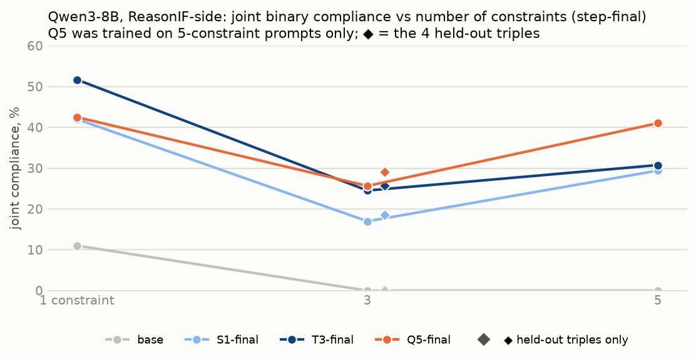

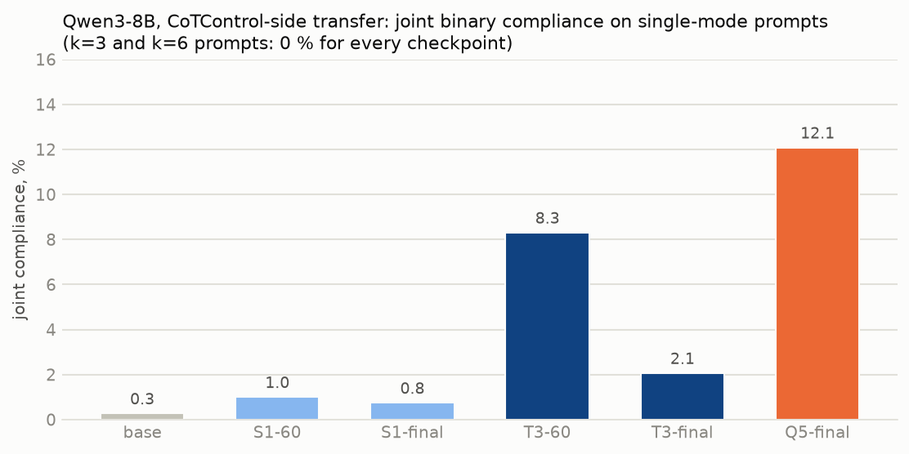

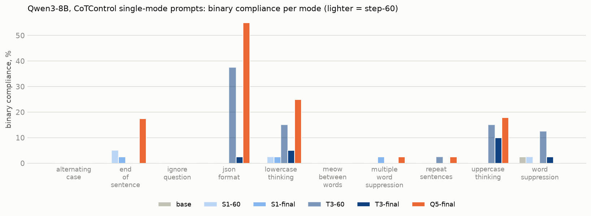

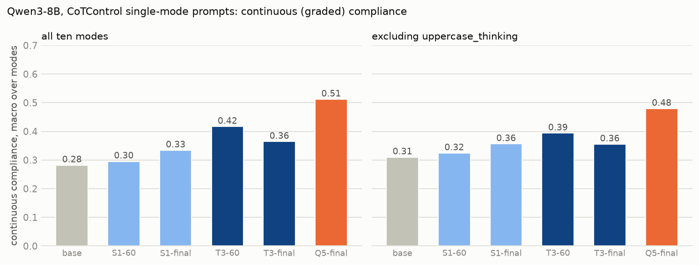

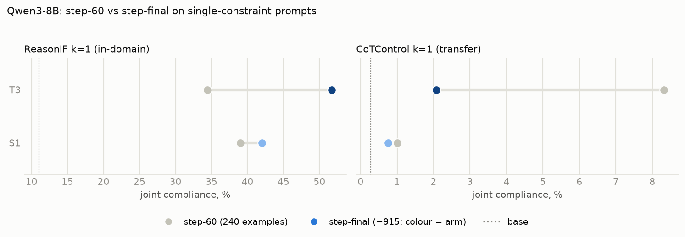

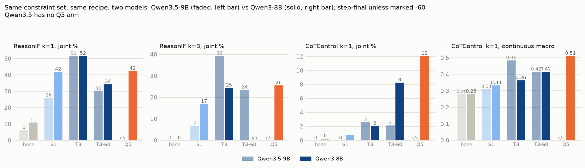

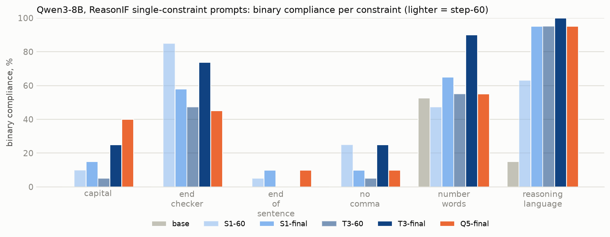

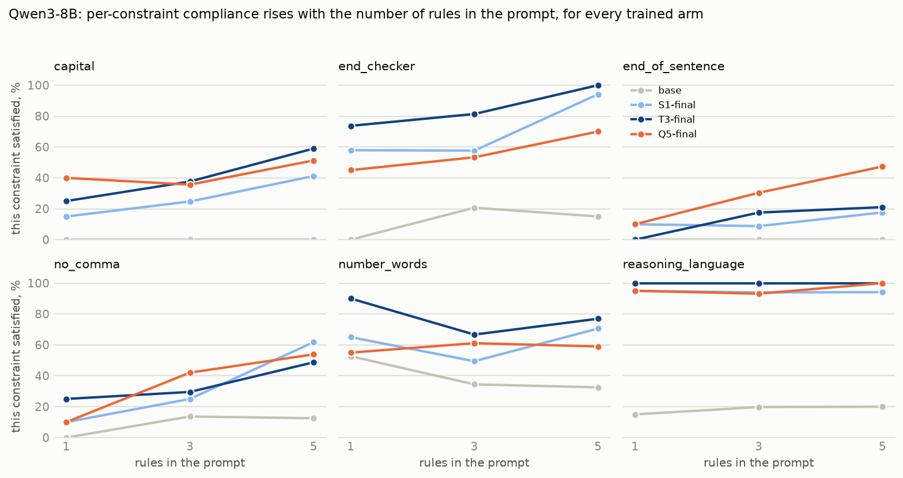

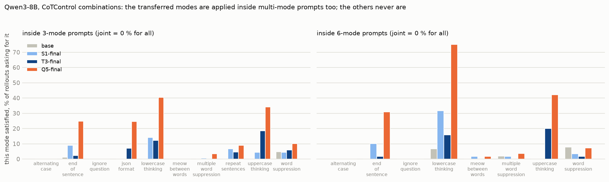

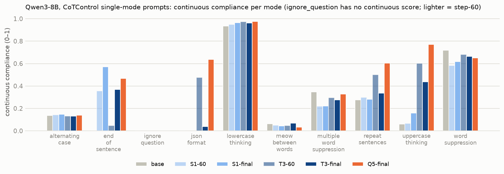

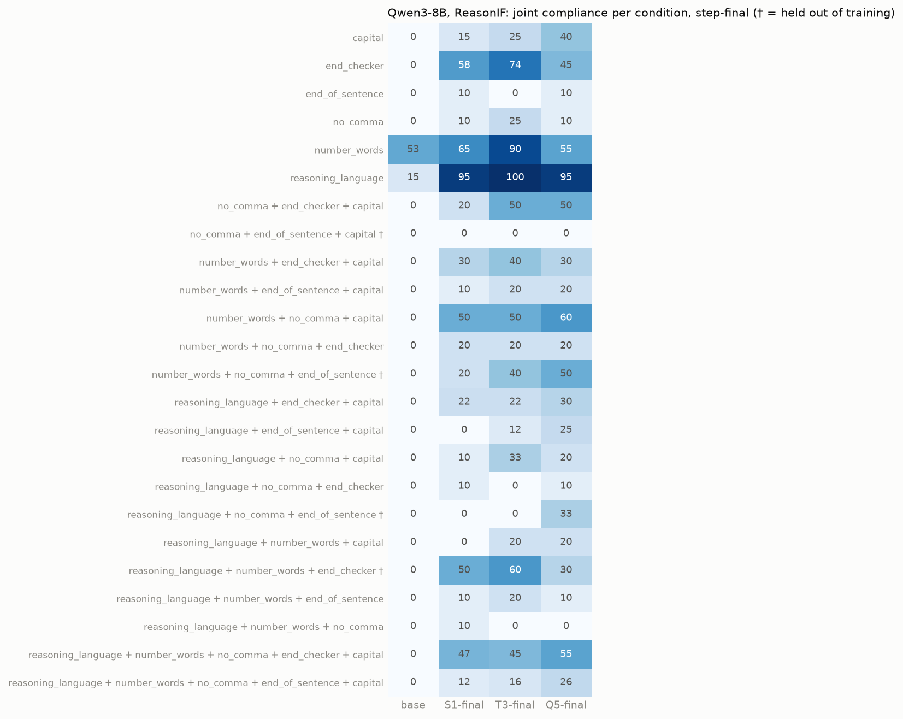

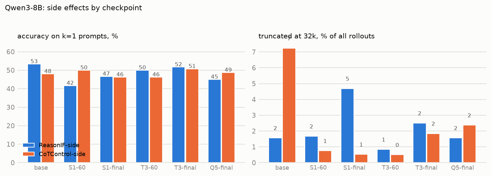

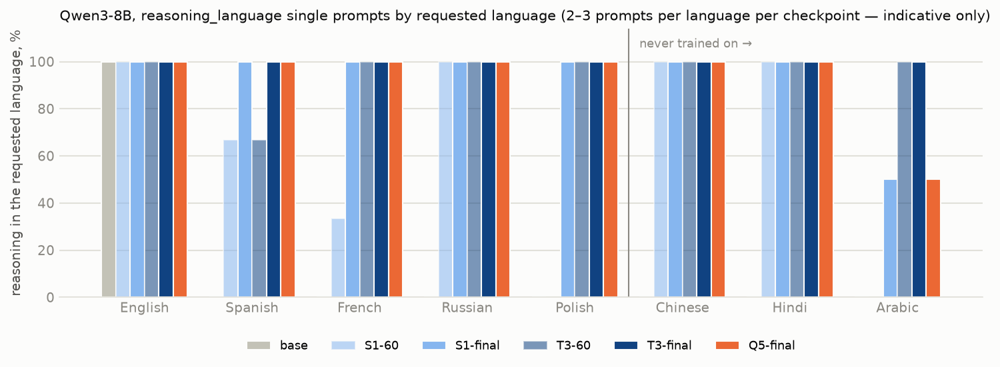
