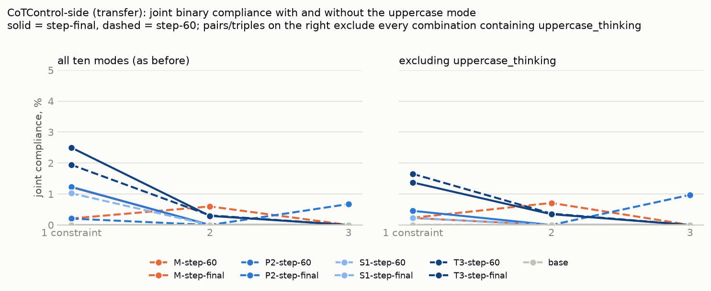
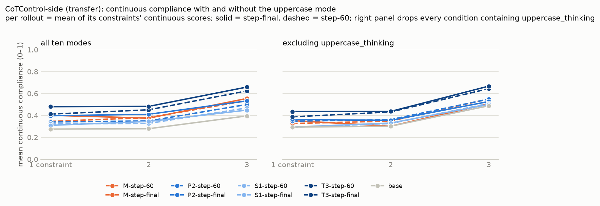
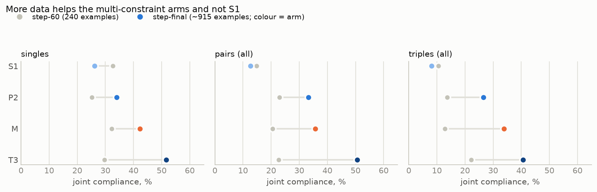

# Multi-constraint training: Slack thread summary (25–26 September 2026)

*Ola's thread summary, transcribed as posted. Figures are the originals from `figures/` (the Qwen3.5-9B
ones from `scripts/report_multi.py`, the Qwen3-8B ones from `scripts/report_qwen3_8b.py`). Full write-ups:
`MULTI_CONSTRAINT_FINDINGS.md` (Qwen3.5-9B) and `QWEN3_8B_FINDINGS.md` (Qwen3-8B).*

---

## 25 September, 6:13 PM

**TL;DR: Training on multiple constraints (as opposed to a single constraint) greatly improves in-domain
CoT-controllability. And it looks promising for out-of-domain controllability - this generalisation we are
chasing. (Still not much uplift with binary scoring, but improvement with continuous scoring of
controllability!)**

Hello, I have some optimistic results! (Just a small summary now, stay tuned for more details on the call 😁)

For the last two weeks, I have had problems replicating controllability from ReasonIF -> CoTControllability
benchmark. I tried training my model with different constraints, but only one at a time (e.g., one rollout
without commas, one rollout in lowercase).

Now, following Luis' suggestion, I have tried training on rollouts that satisfied multiple conditions
simultaneously. I trained on double and triple conditions (e.g. one rollout with {no_commas, spanish}, one
rollout with {number_words, capital, end_checker}). It seems to improve the learnt controllability!
Specifically:

1. It doubles (!) in-domain performance (model trained on triples vs single constraints). The more
   constraints simultaneously -> the model performs better. This is still ReasonIF -> ReasonIF (so not
   evidence of transfer), but is good.

## 25 September, 6:21 PM

2. But the main question is of course whether training on multiple conditions simultaneously increases
   transfer ReasonIF -> CoTControllability?

When we use a binary all-or-nothing measure of controllability, there is some transfer! Although very small
(compare the dark blue line (trained on triples) to the light blue line (trained on singles), it goes up
0.2% -> 1% when tested on one constraint, when excluding this one repetitive uppercase condition). So no
spectacular transfer, but some small signal.

3. I have then checked whether the transfer would increase if we would use a continuous measure of
   controllability. And yes it does!

Compare light blue and grey lines -> they very very similar (which meant no transfer). But now compare dark
blue line (trained on triples) and grey line (base). The dark blue line is above the grey one, which means
transfer worked! (when measured on continuous controllability score)

## 25 September, 6:29 PM

So I think this is promising and motivates further exploration of training on multiple conditions
simultaneously. What to do next:

- I still think that my model, Qwen3.5, is just really bad at controllability. So I would like to replicate
  it on a model with better starting floor controllability. My prediction is that then we can get a transfer
  ReasonIF -> CoTControllability even when measured on binary all-or-nothing score (not just my continuous
  score)
- I also observe a strong trend that models trained on more conditions perform better: triples > doubles ->
  singles. So I think I should also try 4 and 5 conditions simultaneously

Just setting up the next experiment so feedback very welcome!

> **luis ibanez, 8:06 PM:** This is so good!! 🤟 Some light :) Thank you so much! Quite cool to see 3
> constraints rockets 🚀 I originally trained on mixing like 1,2,3,4 and 5 constraints. Mixing in
> percentages of 10. On the same dataset

## 25 September, 8:32 PM

Interesting! So I understand you trained the same model on rollouts with constraints {1, 2, 3, 4, 5} right?
As opposed to training one qwen on {1} constraint, another qwen on {2} constraints and so on.

In my results above, you can see that I have also mixed different numbers of constraints in the same data
set (those are the orange lines). And I found that:

- In-domain (i.e. ReasonIF -> ReasonIF), mixing constraints is better than a single constraint, but still
  WORSE than using triple constraints
- The same is true for out-of-domain (ReasonIF -> CoTControllability) while using continuous
  controllability scores

So my results so far support just ABSOLUTE CONSTRAINT MAXING!!! It seems to be better to use dataset of 5
constraints for every rollout, rather than mix of {1,2,3,4,5} constraints

## 25 September, 8:39 PM

Also, I found that when we use multiple constraints, more training pays off VS when we use just a single
constraint, the training saturates quickly (and continuing to train makes model WORSE if anything lol)

You can see this below. On every graph, for S1 (trained on a single constraint), step-60 is worse than
step-final. And it reverses for all other training set-ups (P2 = trained on double, M = mixed, trained on
{1,2,3}, T3 = trained on triples). This is in-domain (ReasonIF -> ReasonIF)

## 26 September, 10:58 AM

💫 WE HAVE TRANSFER OF CONTROLLABILITY 💫

Yesterday, I looked at multiple constraints on Qwen3.5-9B. It looked promising: I found much better
in-domain performance. However, there was still no transfer to CoTControllability, at least when graded using
binary scores (although there was some when a continuous measure was used).

So I thought: "Ok looks like multiple constraints might have the potential to do transfer. However, I think
that my Qwen3.5 is so exceptionally bad at CoT controllability that it manages to fuck up transfer even with
this potentially great help of multiple constraints".

So, to check if multiple constraints can work for our main plan, I re-run today on another model, Qwen3-8B.
And now..... yes we have transfer!!!

**I found that on Qwen3-8B multiple constraints both increase in-domain performance and generalise to new,
unseen conditions from CoTControllability**

1. Multiple constraints have better in-domain performance (what I found yesterday for Qwen3.5, also holds
   for Qwen3 today):

2. Multiple constraints also finally do transfer to CoTControllability, even when measured with this strict
   all-or-nothing binary score (specifically, trained on triples and on 5s of conditions, transfer better
   than trained on singles)

*(The thread continues beyond this point; the screenshots end here.)*
