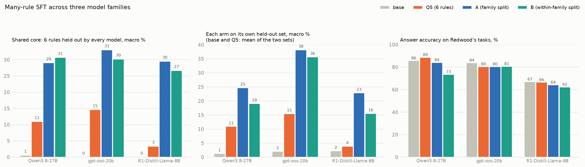
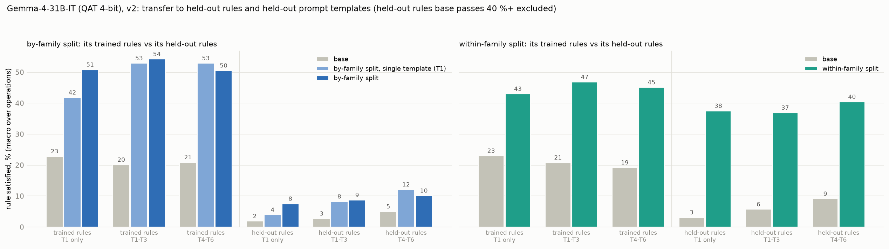
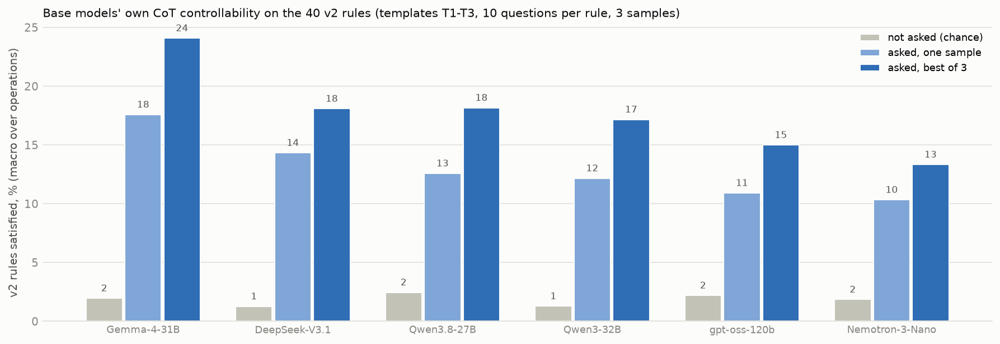
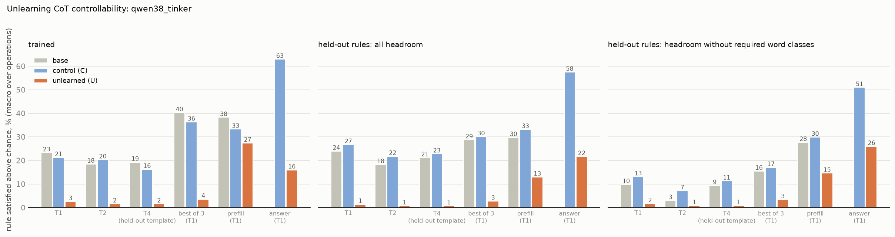

# CoT controllability: summary of results so far

*2026-10-08. Pulls together every findings document in this repository, organised around the two results we want to
report. Each number links to its source document. Colleagues' results (shared Google Drive folder) are not included
yet: the folder needs a Google login that this machine does not have (section 6).*

**The two results:**
1. **A replicable recipe for model organisms that control their chain of thought (CoT):** train on several
   constraints per example, drawn from a diverse set of constraints. Each ingredient is shown side by side on
   several models, and the gain transfers to constraints and prompt templates never seen in training.
2. **Early evidence that fine-tuning can reduce CoT controllability ("unlearning"):** training a model on its own
   reasoning paired with constraints it ignores removes controllability on trained and held-out constraints, on two
   models. The removal holds under resampling, partly under prefilling, and is not specific to the CoT.

---

## 1. Recipe for training CoT controllability

### 1a. More constraints per training example

| model | training arms (constraints per example) | in-domain, single constraint | transfer to an unseen benchmark (CoTControl single modes, all-or-nothing) | source |
|---|---|---:|---:|---|
| Qwen3.5-9B | 1 / 2 / 3 | 26 / 34 / **52 %** | 0 / 1.2 / **2.5 %** (graded score on triples 0.28 → 0.48) | `MULTI_CONSTRAINT_FINDINGS.md` |
| Qwen3-8B | 1 / 3 / 5 | 42 / 52 / 43 % | 0.8 / 2.1 (8.3 at step 60) / **12.1 %** | `QWEN3_8B_FINDINGS.md` |
| gpt-oss-20b | 1 / 3 / 5 | 33 / 38 / 35 % | 3.5 / 3.6 (4.3 at step 60) / 3.4 % (control arm 1.8 %) | `GPTOSS_FINDINGS.md` |

- **In-domain,** more constraints per example helps on both Qwen models. Held-out *combinations* of trained
  constraints rise too: Qwen3.5-9B triples 11 → 42 %; Qwen3-8B 18 → 29 %.
- **Transfer to unseen constraints** grows with constraints per example on Qwen3-8B (0.8 → 12.1 %), little on
  Qwen3.5-9B, and not on gpt-oss-20b.
- **Caveats** (`REVIEW_SLACK_FINDINGS.md`):
  - Qwen3-8B's CoTControl transfer sits in four modes, and three are near-copies of trained constraints (uppercase,
    lowercase, end-of-sentence). The one genuinely new format that moved is JSON (0 → 55 %), which base already
    writes in its answer.
  - Constraints per example is confounded with the number of distinct constraint combinations.
  - Q5 is not better than T3 on single-constraint prompts.

### 1b. A more diverse set of constraints

Same held-out constraints for every arm (the "shared core", held out by all), leakage-corrected, macro over operations
(`MANY_RULES_FINDINGS.md`):

| model | base | 6 constraints, 5 per example (Q5) | ~32 constraints in 10 families, 7 per example (many-rule) |
|---|---:|---:|---:|
| Qwen3.8-27B | 1 % | 9 % | **25 %** |
| gpt-oss-20b | 0 % | 12 % | **29 %** |
| R1-Distill-Llama-8B | 0 % | 3 % | **24 %** |

- **Three models, three families:** the diverse set transfers 2–8 times more than the small set.
- **The gain sits in line-level structure:** bullets, numbered steps, section headers, XML.
- **Accuracy cost:** 2–4 points (many-rule by-family arm).

### 1c. The small recipe transfers only to formats the model already uses

Few-constraint training transfers on Redwood's held-out instructions but not on CoTControl or our never-seen
constraints (`REDWOOD_GPTOSS_ANALYSIS.md`, `QWEN38_FINDINGS.md`):

| model, few-constraint arm | Redwood's 9 held-out (macro) | CoTControl | 30 never-seen constraints |
|---|---:|---:|---:|
| gpt-oss-20b | 2 → 22–28 % (bullets 0 → 77 %) | 1.5 → 3–4 % | no change once restating is removed |
| Qwen3.8-27B (Q5) | 11 → 35 % | 0 → 11 % (near-copies) | 15 → 15 % |

The transferring formats (bullets, numbered lists, JSON) are ones the base model already produces in its answers.

### 1d. The recipe on a clean, audited constraint suite (v2)

40 distinct constraints (10 families × 2 operations × 2 constraints), six prompt templates (T1–T3 trained,
T4–T6 held out), leakage audit before training, chance-corrected scoring (`CONDITIONS_V2.md`, `TEMPLATES_V2.md`).

| held-out constraints, % (macro) | trained templates T1–T3 | unseen templates T4–T6 | source |
|---|---:|---:|---|
| gpt-oss-20b: base → by-family split | 3 → 24 | 3 → 16 | `V2_GPTOSS_FINDINGS.md` |
| gpt-oss-20b: base → within-family split | 2 → 28 | 2 → 25 | |
| Gemma-4-31B: base → by-family split | 3 → 9 | 5 → 10 | `V2_GEMMA_FINDINGS.md` |
| Gemma-4-31B: base → within-family split | 6 → **37** | 9 → **40** | |

- **Transfer reaches unseen prompt templates.** Fully on Gemma; on gpt-oss it costs 3–12 points, and the
  developer-message template is gpt-oss's weak spot.
- **Siblings vs other families.** Transfer is strongest to sibling constraints of trained ones (within-family).
  Across families it is real on gpt-oss and small on Gemma: with constraints base already passes kept in, Gemma's
  by-family split shows no net gain.
- **Training on one template** transferred about as well as training on three (gpt-oss, one seed).
- **Side effects:**
  - accuracy falls 0–7 points;
  - reasoning gets 25–45 % shorter;
  - restating the rule falls from about 60 % to about 12 % of traces.

### 1e. Prompting is not a substitute (elicitation)

Eight strategies on base and fine-tuned models: rewording, monitoring awareness, rules repeated, worked example,
best of 3, prefill, a gpt-5-optimised prompt (`ELICITATION_RESULTS.md`).

| all constraints met | Qwen3-8B | gpt-oss-20b |
|---|---:|---:|
| base: plain → best admissible strategy (prefill) | 8 → 33 % | 8 → 17 % |
| fine-tuned: plain → best of 3 | 48 → 58 % | 26 → 36 % |
| rewording strategies | ±4 points | ±5 points |

Fine-tuning beats every admissible elicitation of base. Best of 3 is the most reliable elicitation; prefill helps
only base models.

---

## 2. Unlearning: fine-tuning can reduce CoT controllability

### 2a. Removing controllability we trained in (Qwen3-8B, `UNLEARNING_FINDINGS.md`)

Starting from Q5 (fine-tuned to be controllable), training on 667 of its own traces paired with a CoTControl
instruction the trace ignores:

| binary macro | base | Q5 | unlearned | control (same traces, no instruction) |
|---|---:|---:|---:|---:|
| trained-away CoTControl modes | 0 | 5 | **0** | 5 |
| held-out CoTControl modes (JSON, lowercase) | 0 | 26 | **0** | 31 |
| never-seen stop-words constraint | 0 | 40 | **2** | 46 |
| the six phase-1 constraints (other benchmark and template) | 10 | 45 | **16** | 44 |

Controllability behaves like one shared skill: ignoring eight modes removes it everywhere.

### 2b. Removing a base model's own controllability (Qwen3.8-27B, `UNLEARNING_V2_QWEN38_FINDINGS.md`)

**Choosing the model.** We screened six base models for genuine, chance-corrected controllability
(`SCREENING_V2_FINDINGS.md`):
- Gemma-4-31B and Qwen3.8-27B had the most.
- Nemotron-3-Nano's apparent control was almost all restating the rule.

**The run.** Full-precision Qwen3.8-27B on Tinker. U is trained on 898 of its own traces, each paired with one v2
constraint it ignores; the control C is trained on the same traces without the constraint. The rule split was
pre-registered (per-model matched pairs of operations).

| % above chance | base | control | unlearned |
|---|---:|---:|---:|
| trained constraints: T1 / T2 / T4 (unseen template) | 23 / 18 / 19 | 21 / 20 / 16 | **3 / 2 / 2** |
| held-out constraints: T1 / T2 / T4 | 24 / 18 / 21 | 27 / 22 / 23 | **1 / 1 / 1** |
| held-out, best of 3 | 29 | 30 | **3** |
| trained, prefill (continuation only) | 38 | 33 | **27** |
| held-out, prefill | 30 | 33 | **13** |
| constraints applied to the answer (trained / held-out) | – | 63 / 58 | **16 / 22** |

- **Generalises** to held-out constraints, near and far, and to an unseen template.
- **Best of 3 does not restore it.**
- **Prefill restores part of it.** U stays below base under the same prefill, but on trained constraints it reaches
  base's plain-prompt level, which fails the pre-registered test.
- **Not specific to the CoT:** U also stops applying formatting constraints to its answer.
- **Side effects:** reasoning 35 % shorter; restating falls from 65 % to 4 %; accuracy 90 → 95 %.

**Intrinsic or extrinsic?** The method may reduce only *extrinsic* controllability (responding to instructions about
the CoT) rather than the model's *intrinsic* ability. The answer-side result fits that reading: U ignores formatting
instructions wherever they point. Planned tests:
- steganography evaluations;
- a variant whose training answers do follow the constraint, so only the reasoning ignores it;
- the relearning attack (fine-tuning U on 64 compliant examples; data ready).

---

## 3. Evaluation pitfalls we found (each changed a headline)

| pitfall | what happened | fix | source |
|---|---|---|---|
| Train–test leakage | v1: the within-family split's apparent advantage came from rewrites that removed function words, so held-out word bans passed by accident (36 % → 17 % once removed) | leakage audit before training; leaked constraints excluded | `CONDITION_SPLIT.md`, `MANY_RULES_FINDINGS.md` |
| Reworded duplicates | variants of one rule counted as separate conditions (49 conditions = 31 distinct rules) | macro over operations; the v2 suite of 40 distinct constraints | `CONDITION_SPLIT.md`, `CONDITIONS_V2.md` |
| Restating the rule | base models quote the instruction in their reasoning, which passes inclusion-type constraints. On gpt-oss "never-seen" constraints this made training look harmful; Nemotron's controllability falls from 10 % to 2 % without it | score with and without restating traces | `GPTOSS_FINDINGS.md`, `SCREENING_V2_FINDINGS.md` |
| Chance passes | some constraints are satisfied without being asked (length limits, English); uncorrected scores overstate control (e.g. a colleague's gpt-oss-120b base) | subtract each model's chance rate; report with and without constraints base passes 40 %+ | `SCREENING_V2_FINDINGS.md`, `V2_GEMMA_FINDINGS.md` |
| All-or-nothing grading | one stray letter fails a 4,000-word trace | continuous scores alongside binary | `CONTINUOUS_SCORING.md` |
| Prefill grading | the prefilled sentence itself satisfies many constraints | grade only the model's continuation | `UNLEARNING_V2_QWEN38_FINDINGS.md` |

**Meta-discussion is not the bottleneck.** Deleting every narration sentence flips 1 of 4,900 failing traces to
passing (`STRIP_TEST.md`). A linear "narration" direction exists in activations (AUROC 0.84, `STEERING_RESULTS.md`),
but suppressing narration would not by itself raise compliance.

---

## 4. Limitations

- **One training seed per arm everywhere.** Gaps under about 10 points may be noise.
- **Open-weight models only,** up to about 31B parameters (plus screening of DeepSeek-V3.1 and gpt-oss-120b).
- **Unlearning:**
  - two models (Qwen3-8B from a fine-tuned start, Qwen3.8-27B from base);
  - Gemma not yet run;
  - relearning attack not yet run;
  - not specific to the CoT.
- **Small evaluations:** 10–20 questions per constraint, so single-constraint numbers are uncertain by about
  ±15–25 points.
- **Released models:** on Hugging Face (`Cot-control-spar/cot-control-treated-models`), currently private.

## 5. Models available

| model | base | controllability increased | controllability unlearned |
|---|---|---|---|
| Qwen3.8-27B | `Qwen/Qwen3.8-27B` | `qwen3.8-27b-A` (many-rule v1, 4-bit base) | `qwen3.8-27b-v2-unlearned` (full precision) |
| Gemma-4-31B | `google/gemma-4-31B-it-qat-w4a16-ct` | `gemma-4-31b-v2-within-family` | – |
| gpt-oss-20b | `openai/gpt-oss-20b` | `gpt-oss-20b-A` (many-rule v1); `gpt-oss-20b-Q5` (few-rule) | – |

## 6. Colleagues' results (to add)

The shared folder (Google Drive, `1Fj4F-m8z6YbRBhKfvBoWBjpVRymP-A3k`) could not be read from here. Results we know of
from conversation:
- **Ilinca's gpt-oss-20b run,** same constraints and a T1-style template: 35 % trained / 35 % held-out, against our
  single-template arm's 32 / 29 % (`V2_GPTOSS_FINDINGS.md`).
- **A colleague's gpt-oss-120b v1 run:** base and fine-tuned compliance by family; strongest out-of-distribution gain
  in Structure (28 → 63 %), not chance-corrected.
- **A colleague's SPAR week-3 gpt-oss-20b runs (V2, V2.1, V3):** they agree that few-constraint training improves
  trained constraints but not unseen ones on their own (`GPTOSS_VS_COLLEAGUE.md`).

## 7. Document index

| topic | documents |
|---|---|
| few-constraint SFT | `MULTI_CONSTRAINT_FINDINGS.md` (Qwen3.5-9B), `QWEN3_8B_FINDINGS.md`, `GPTOSS_FINDINGS.md`, `QWEN38_FINDINGS.md`, `TRANSFER_RECONCILIATION.md`, `NEVER_SEEN_RESULTS.md`, `REVIEW_SLACK_FINDINGS.md` |
| Redwood comparison | `REDWOOD_GPTOSS_ANALYSIS.md`, `GPTOSS_VS_COLLEAGUE.md` |
| many-rule SFT (v1) | `MANY_RULES_FINDINGS.md`, `CONDITION_SPLIT.md` |
| v2 suite | `CONDITIONS_V2.md`, `TEMPLATES_V2.md`, `V2_GPTOSS_FINDINGS.md`, `V2_GEMMA_FINDINGS.md` |
| elicitation | `ELICITATION_PLAN.md`, `ELICITATION_RESULTS.md` |
| unlearning | `UNLEARNING_FINDINGS.md` (Qwen3-8B), `SCREENING_V2_FINDINGS.md`, `UNLEARNING_V2_PLAN.md`, `UNLEARNING_V2_QWEN38_FINDINGS.md` |
| meta-discussion and grading | `META_DISCUSSION_SUMMARY.md`, `STRIP_TEST.md`, `NARRATION_VS_CONDITIONS.md`, `CONTINUOUS_SCORING.md`, `STEERING_RESULTS.md` |
