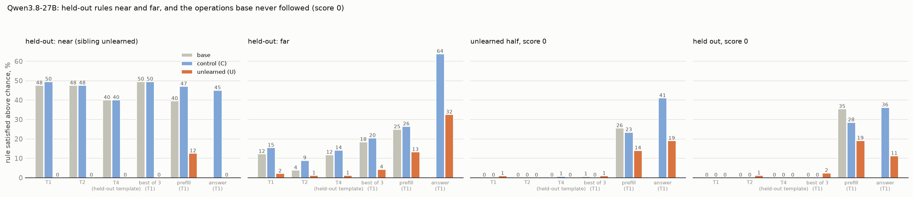

# Unlearning CoT controllability on Qwen3.8-27B: findings (lean run)

*2026-10-08. Design: `UNLEARNING_V2_PLAN.md` (lean $60 scope, one seed). Model chosen by screening
(`SCREENING_V2_FINDINGS.md`). Everything ran on Tinker: `scripts/v2/unlearn_build.py` (data), `scripts/v2/train_tinker.py`
(LoRA), `scripts/v2/unlearn_eval.py` (evaluation), `scripts/v2/unlearn_report.py` (tables and figures). Training curves:
W&B `spar_controllability/cot-control-ft`, group `unlearn-v2-qwen38`.*

## Headline

**Training Qwen3.8-27B on its own reasoning paired with rules that reasoning ignores removes its CoT controllability
almost completely: on the trained rules (about 20 % → 2–3 %), on held-out rules (24 % → 1 %), and in a template it never
saw. The removal holds up under best of 3, but not under prefilling: started in the required format, the unlearned model continues
it about as often as base follows the rule plainly. The removal is not specific to the reasoning: the unlearned model
also stops applying the rules to its answer.**

## Setup

- **Model:** Qwen3.8-27B, medium reasoning effort, temperature 1.0, top-p 0.95, top-k 20 (as in screening).
- **Rule split:** the locked per-model matched-pair split of the 20 operations (`data/unlearn_v2_splits.json`).
  - **Trained** (unlearned, base score above 0): required words, total word count, uniform case, sentence mood,
    natural language (10 rules).
  - **Held out with headroom:** required word classes, trace boundaries, character bans, lexical density, word bans,
    number notation. **Near** (family sibling unlearned): required word classes, number notation. **Far**: the other four.
  - **Score 0** (base never followed them): five in the unlearned half (not trained), four held out.
- **Training data:** 899 of the model's own unconstrained traces (700 on the v2 training questions, 200 from
  screening). Each is paired with one trained rule, in T1, T2 or T3, that the grader confirms the trace breaks; every
  trace broke its rule, so all 899 were kept. Nothing is rewritten; the answer is the model's own.
- **Arms:**
  - **U (unlearned):** rule in the prompt, the trace ignores it.
  - **C (control):** the same 899 traces under their original prompt, no rule.

  Both use LoRA rank 32 on attention and MLP, learning rate 1e-4, batch 4, one epoch (225 steps), one seed. The loss
  stays flat for both (U 0.39 → 0.36, C 0.34 → 0.35): they train on the model's own text.
- **Evaluation:** 40 rules × 10 questions per rule (the v2 evaluation questions).
  - **Plain prompting:** templates T1 and T2 (seen in training) and T4 (the rule in the developer message; never seen).
  - **Best of 3**, on T1.
  - **Prefill**, on T1: the reasoning is started with a compliant opening sentence written by gpt-4.1. Only the model's
    own continuation is graded.
  - **Answer:** on T1, the rule applied to the final answer instead.

  Base's T1 and T2 scores and its best of 3 come from screening.
- **Metric:** % of prompts satisfying the rule, minus that arm's chance rate (its own unconstrained traces; 100 per arm),
  floored at 0, averaged over operations.

## Results

| % above chance | base | control (C) | unlearned (U) |
|---|---:|---:|---:|
| **trained rules:** T1 / T2 / T4 | 23 / 18 / 19 | 21 / 20 / 16 | **3 / 2 / 2** |
| trained rules: best of 3 | 40 | 36 | **4** |
| trained rules: prefill (continuation only) | 38 | 33 | **27** |
| trained rules: applied to the answer | – | 63 | **16** |
| **held-out rules:** T1 / T2 / T4 | 24 / 18 / 21 | 27 / 22 / 23 | **1 / 1 / 1** |
| held-out, without "required word classes": T1 / T2 / T4 | 10 / 3 / 9 | 13 / 7 / 11 | **2 / 1 / 1** |
| held-out: best of 3 | 29 | 30 | **3** |
| held-out: prefill (continuation only) | 30 | 33 | **13** |
| held-out: applied to the answer | – | 58 | **22** |

| | base | control (C) | unlearned (U) |
|---|---:|---:|---:|
| answer accuracy | 90 % | 90 % | 95 % |
| median reasoning, words | 210 | 208 | 136 |
| reasoning restates the rule | 65 % | 58 % | 4 % |

1. **Control is removed, and the removal spreads.**
   - **Trained rules:** about 20 % → 2–3 % in every template, including T4, which U never saw.
   - **Held-out rules:** 24 % → 1 %; without "required word classes", 10 % → 2 %.
   - **Control arm:** C stays at base level throughout, so the drop comes from pairing traces with rules they ignore,
     not from fine-tuning on the model's own reasoning.
2. **Best of 3 does not bring it back.** Three samples get U to 3–4 %, against 29–40 % for base.
3. **It does not survive prefill on the trained rules.**
   - **Trained rules:** once its reasoning is started in the required format, U continues compliantly on 27 % of
     prompts. That is above base under a plain prompt (23 %) and recovers more than C does (24 points against 12),
     so it fails both parts of the pre-registered "survives" test.
   - **Held-out rules:** prefill gets U to 13 %, below base plain (24 %) and below C's gain. It passes there.
   - **Prefill is a strong push for any model.** Even rules base never follows reach 26–35 % with prefill (figure
     below). It measures continuing a format that has been started as much as following an instruction.
4. **The removal is not specific to the reasoning.** Asked to apply the same rules to its **answer**, U manages 16–22 %
   against C's 58–63 %. U has learned to ignore formatting instructions in general. This follows from the training data:
   each training answer was the model's own, which ignored the rule too.
5. **Side effects:**
   - **Reasoning:** U writes much shorter reasoning (136 against 210 words) and almost never restates the rule (4 %
     against 65 %). It ignores the instruction rather than discussing it.
   - **Accuracy:** rises slightly (95 % against 90 %).

**Near and far.** Both held-out groups lose everything (near 48 → 0 %, far 12 → 2 %). "Near" here is mostly one
operation, "required word classes" (the other, number notation, is near 0 for base), so the near/far comparison rests on
few operations.

**Operations base never followed** stay at 0–2 % for every arm under plain prompting and best of 3: training gave U no
new control. Under prefill and on the answer, U is again below base and C.

## Against the pre-registered "survives" test

The plan's test for prompt-only access has two conditions:
1. U under the strategy stays below base under the plain prompt (T1);
2. U's gain from the strategy is less than half of C's gain.

| | U elicited vs base plain | U gain vs C gain | verdict |
|---|---|---|---|
| trained rules, best of 3 | 4 < 23 ✓ | +1 vs +15 ✓ | **survives** |
| trained rules, prefill | 27 > 23 ✗ | +24 vs +12 ✗ | **fails** |
| held-out rules, best of 3 | 3 < 24 ✓ | +2 vs +3 ✗ (half of C's gain is 1.5) | **technically fails; within noise** |
| held-out rules, prefill | 13 < 24 ✓ | +12 vs +6 ✗ | **fails condition 2** |
| weight access (relearning) | – | – | not run |

The second condition breaks down when C itself barely gains, as with best of 3 on held-out rules (+3 points). The
plan should specify a minimum C gain before it applies. The clear results are:
- best of 3 does not bring control back;
- prefill does, fully on the trained rules and partly on held-out rules.

## Caveats

- **One seed, 10 questions per rule:** single-rule numbers are uncertain by about ±15 points; group averages are much
  tighter. The near group has effectively one operation.
- **Prefill openings** were written by gpt-4.1 per question and rule. The same opening is used for all three arms,
  and only the continuation is graded.
- **Chance rates** for the four judged rules come from screening for every arm (not re-measured).
- **The relearning attack has not been run.** 64 compliant examples of held-out rules are ready
  (`data/sft/unlearn_v2_qwen38_tinker_relearn64.jsonl`; base complied on 27 % of 295 prompts, mostly inclusion rules
  and no commas). Tinker cannot resume training from the saved U checkpoint (only its sampling weights were saved), so
  the attack needs U retrained with resumable checkpoints.

## Cost

About **$53** on Tinker so far, from token counts:

| item | cost |
|---|---:|
| traces for the training data | $4 |
| training U and C | ~$11 |
| evaluation: U | $13 |
| evaluation: C | $19 |
| evaluation: base (T4 and prefill) | $5 |
| samples for the relearning set | $3 |

Plus a few dollars of gpt-4.1 (prefill openings, judge).

## Next steps

1. **Relearning attack** (about $11): retrain U with resumable checkpoints, fine-tune on the 64 compliant examples,
   re-evaluate T1.
2. **Specificity fix, U2** (about $20): the same pairs, but with each training answer rewritten to follow the rule
   (gpt-4.1), so that only the reasoning ignores it. This tests whether the loss can be confined to the chain of thought.
3. **Gemma-4-31B**, the other chosen model, when a local GPU is free (it is not on Tinker).
