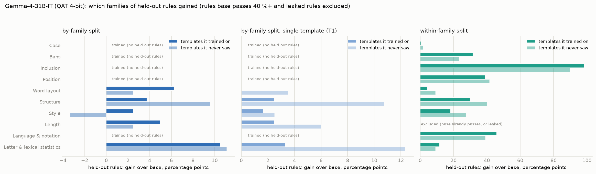
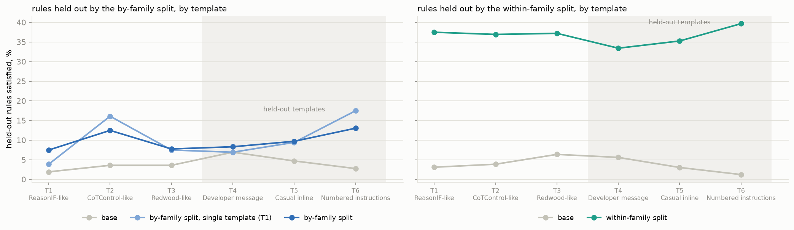
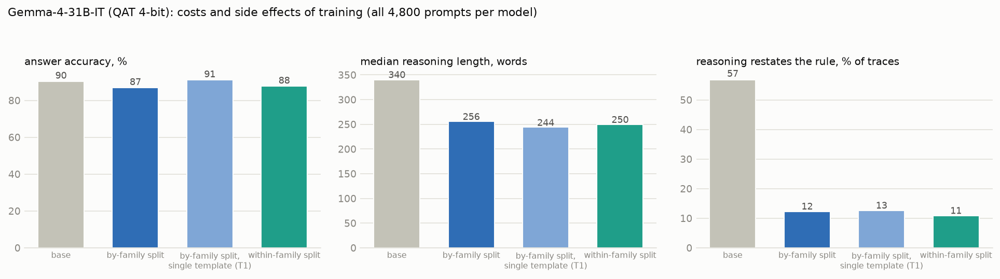

# v2 on Gemma-4-31B-IT (QAT 4-bit): findings

*2026-10-05. Same design as `V2_GPTOSS_FINDINGS.md`: the 40 v2 rules (`CONDITIONS_V2.md`), six no-tag templates
(`TEMPLATES_V2.md`; T1–T3 trained, T4–T6 held out), three arms trained with 7 rules per example: by-family split,
by-family split on T1 only (single template), within-family split. 449 training examples per arm (454 built, 5 over
3,072 tokens dropped), QLoRA r 32, one epoch, one seed per arm. Evaluation: 40 rules × 6 templates × 20 questions =
4,800 prompts per model, thinking on, temperature 1.0, top_p 0.95, top_k 64. Scores are a macro over operations;
held-out scores exclude rules base already passes on 40 %+ of prompts and the rules the audit flagged as leaked.
Figures: `scripts/v2/report.py`, `scripts/v2/report_more.py` with `V2_RUN=gemma`.*

## Headline

| % of prompts, macro over operations | trained rules: T1 / T1–T3 / T4–T6 | held-out rules: T1 / T1–T3 / T4–T6 |
|---|---:|---:|
| base (by-family rules) | 23 / 20 / 21 | 2 / 3 / 5 |
| by-family split | 51 / 54 / 50 | 8 / 9 / 10 |
| by-family, T1 only | 42 / 53 / 53 | 4 / 8 / 12 |
| base (within-family rules) | 23 / 21 / 19 | 3 / 6 / 9 |
| **within-family split** | 43 / 47 / 45 | **38 / 37 / 40** |

1. **Training more than doubles compliance on the trained rules** (20–23 % → 42–54 %), and this carries over to
   templates the model never saw: T4–T6 are within 4 points of T1–T3 for every arm.
2. **The within-family split transfers strongly; the by-family split barely does.** Held-out rules that are siblings
   of a trained operation go from 3–9 % to 37–40 %. Rules from families the model never trained on go from 2–5 % to
   8–12 %.
3. **Template transfer is nearly free on Gemma.** Held-out rules in held-out templates (T4–T6) score as well as or
   better than in the training templates, for all three arms.
4. **The single-template arm is not worse.** Trained on T1 only, it matches the three-template arm on T2–T6 for
   trained rules (53 vs 50–54 %) and on held-out rules (8–12 vs 9–10 %). It is lower only on T1 itself (42 vs 51 %),
   the same oddity as on gpt-oss: the single-template arm does better on templates it never saw than on its own.

## Compared with gpt-oss-20b

| held-out rules, T1–T3 / T4–T6 | gpt-oss-20b | Gemma-4-31B |
|---|---:|---:|
| base | 2–3 / 2–3 | 3–6 / 5–9 |
| by-family split | 24 / 16 | 9 / 10 |
| by-family, T1 only | 34 / 22 | 8 / 12 |
| within-family split | 28 / 25 | **37 / 40** |
| trained rules, by-family split | 32 / 26 | 54 / 50 |

- **Base Gemma is more controllable** on the rules it is later trained on (20–23 % against 12–15 % for gpt-oss).
- **Gemma learns the trained rules better** and loses less in unseen templates.
- **Gemma's transfer is narrower.** It reaches siblings of trained rules but hardly crosses family lines, whereas
  gpt-oss transferred across families (24–34 %). On gpt-oss the within-family split led by 4 points; on Gemma by
  28 points.

## Which rules moved

Within-family split, held-out rules, T1–T3 / T4–T6 (base → trained):

| held-out rule | sibling trained by this arm | base | within-family |
|---|---|---:|---:|
| Use a word exactly twice | required word classes (conjunctions, transitions) | 0 / 5 | 98 / 95 |
| Start every sentence with a given word | trace boundaries (start/end phrase) | 0 / 0 | 67 / 60 |
| Numbers written in words | natural language | 8 / 18 | 62 / 67 |
| Markdown table | markup (XML, JSON) | 0 / 0 | 50 / 65 |
| Numbers as Roman numerals | natural language | 0 / 5 | 38 / 35 |
| No commas | word bans | 37 / 38 | 68 / 62 |
| No colons (leaked, excluded) | word bans | 5 / 12 | 27 / 18 |
| Pirate speak | sentence mood | 7 / 7 | 25 / 27 |
| No word longer than 8 letters | lexical density | 2 / 2 | 23 / 18 |
| Alternating letter / word case | uniform case | 0 / 0 | 0–3 |
| A filler word between every two words | line breaking | 0 / 0 | 0 / 3 |

The by-family split's held-out families gain 2–11 points each (largest: letter and lexical statistics, structure in
unseen templates). Style does not transfer across families on Gemma (−3 to +2), unlike gpt-oss, where it was the
largest gain.

**Checked for leakage.** The two largest within-family gains name specific words ("crucially" exactly twice; every
sentence starting with "Indeed"). Neither word was taught: "crucially" appears in 1 of 454 training traces and
"Indeed" in 16, and the audit found both rules at 0 % in training and base traces alike. The passing traces are
genuine: "Crucially, this step converts …" placed twice; "Indeed, the first step is …" before every sentence.

## Templates

No held-out template is a weak spot on Gemma. On gpt-oss, T4 (the rule in the developer message) dropped the
by-family arms to 9–12 %. On Gemma, T4 is as good as T1–T3: the developer message becomes Gemma's system turn,
which it follows as readily as the user turn.

## Costs

| | base | by-family | within-family | T1 only |
|---|---:|---:|---:|---:|
| answer accuracy, % | 90 | 87 | 88 | 91 |
| median reasoning, words | 340 | 256 | 250 | 244 |
| restates the rule, % of traces | 57 | 12 | 11 | 13 |
| truncated, % | 0.4 | 0.3 | 0.2 | 0.4 |

Smaller accuracy cost than on gpt-oss (−3 points at most, none for the T1-only arm), shorter traces, and much less
talk about the rule, as before.

## Checks and caveats

- **Leaked rules excluded** (pre-training audit, `results/v2_gemma/audit.log`):
  - by-family: "at least M words" (+18 points in training traces). The gpt-4.1 rewrite made Gemma's training traces
    19 % longer than its own, despite the length gate;
  - within-family: "no colons" (+13), as on gpt-oss.
- **Training length cap 3,072 tokens** instead of 4,096 (gpt-oss): one 3.9k-token example ran out of GPU memory.
  This drops 5 of 454 examples per arm.
- **Smaller training set than gpt-oss** (449 against 554 per arm): the within-family build kept only 454 of 937
  examples, and the other arms were cut to match.
- **One seed per arm.** The 28-point within-family lead is far beyond seed noise seen so far (6–10 points); the
  single-template vs three-template differences are not.
- **Base sometimes passes held-out rules already:** sports commentator, "at most N words", "include a marker",
  "at least M words" are at 40 %+ for base and are excluded from held-out scores.
- **Run history** (issues): training failed out of memory overnight and the supervisor retried it about 10 times
  before it was noticed (fixed by checkpointing the chunked loss and the length cap); the last two evaluations ran on
  skynet4 while skynet3 was in use.
