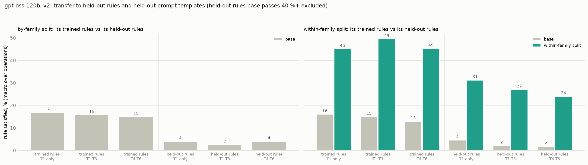
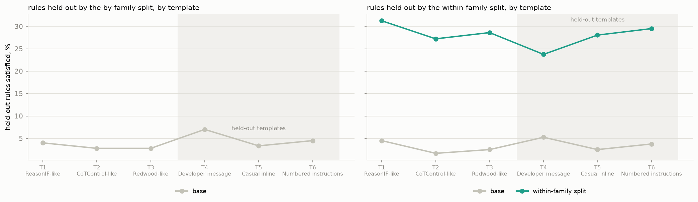
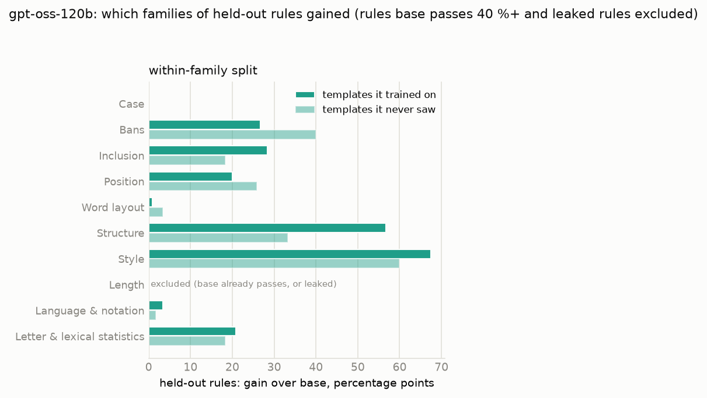

# v2 on gpt-oss-120b (Tinker): findings, within-family split only

*2026-10-09. Same design as `V2_GPTOSS_FINDINGS.md` and `V2_GEMMA_FINDINGS.md`, run entirely on Tinker
(`openai/gpt-oss-120b`, full precision, renderer `gpt_oss_medium_reasoning`, temperature 1.0, top-p 1.0). One arm only:
the **within-family split** (near transfer), 7 rules per example, 575 training examples (575 of 937 rewrites passed),
LoRA rank 32, one epoch, one seed. Evaluation: 40 rules × 6 templates × 20 questions = 4,800 prompts per model.
Stage script: `results/v2_gptoss120b/stage.sh`; figures from `scripts/v2/report.py` and `report_more.py`.*

## Headline

**Training gpt-oss-120b on 575 examples raises compliance on held-out sibling rules from 2 % to 27 % in the training
templates and from 2 % to 24 % in templates it never saw, almost exactly what the same recipe gave gpt-oss-20b
(2 → 28 % and 2 → 25 %). Accuracy is unchanged (88 → 86 %).**

| % of prompts, macro over operations | trained rules: T1 / T1–T3 / T4–T6 | held-out rules: T1 / T1–T3 / T4–T6 |
|---|---:|---:|
| base | 16 / 15 / 13 | 5 / 2 / 2 |
| within-family split | 45 / 49 / 45 | **31 / 27 / 24** |

Held-out scores exclude rules base already passes on 40 %+ of prompts and the one leaked rule (no colons). Keeping
every held-out rule except the leaked one: base 10–11 % → trained 29–32 %.

## By template

| template | T1 | T2 | T3 | T4 (developer message) | T5 | T6 |
|---|---:|---:|---:|---:|---:|---:|
| base, held-out rules | 4 | 2 | 2 | 5 | 2 | 4 |
| within-family, held-out rules | 31 | 27 | 29 | 24 | 28 | 30 |

No template is a weak spot. On Tinker the developer message (T4) is passed to gpt-oss as a system message, so T4 is not
exactly the same prompt as in the gpt-oss-20b run (vLLM, developer role); there gpt-oss-20b's by-family arm was weak
on T4, its within-family arm less so.

## Which held-out rules moved

## Costs and checks

| | base | within-family |
|---|---:|---:|
| answer accuracy | 88 % | 86 % |
| median reasoning, words | 183 | 129 |
| restates the rule | 69 % | 12 % |
| truncated | 0 % | 0 % |

- **Leakage audit:** one held-out rule flagged, "no colons" (+12 points in training traces), as for every
  within-family run so far; excluded. The rewritten training traces are 12 % longer than gpt-oss-120b's own (median
  ratio 1.12). No held-out template wording in any training prompt.
- **Cost:** about $7 on Tinker for sampling (937 base traces and 9,600 evaluation prompts) plus under $1 for training;
  gpt-4.1 rewriting and judging on OpenAI. About 55 minutes end to end.
- **One seed, one arm.** No by-family (far transfer) arm on v2; the team's week-4 run gives gpt-oss-120b a far-transfer
  number on a different rule set (held-out families 22.7 → 35.2 %, not chance-corrected).
